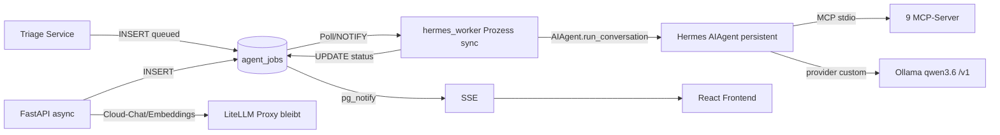

# Entscheidungs-Memo: Nanobot → Hermes Agent

Stand: 14. Juni 2026 · Status: **Empfehlung GO (bedingt)** · Autor: Spike-Analyse

## 1. Frage

Soll TaskPilot die Agent-Runtime von **Nanobot** (`nanobot-ai>=0.2.0`, in-process im FastAPI-Backend) auf **Hermes Agent** (Nous Research) umstellen? Treiber ist nicht der Aufwand, sondern die strategische Frage, mit welchem Framework sich die Assistent-Vision besser ausbauen lässt — auch im Hinblick auf erste Kundenanfragen. Vorgabe: **Agent läuft lokal** (Ollama/qwen3.6), Cloud nur für unkritische Fälle.

Ein erster Hermes-Versuch (Branch `feature/hermes-migration`, Commit `02a89fd`, 5. Mai) wurde abgebrochen mit den dokumentierten Gründen: Tools werden nicht ausgeführt (JSON statt Execution), kein sichtbares Thinking, falsche Tool-Auswahl, LiteLLM-Konflikte.

## 2. Kernergebnis des Spikes

Alle damaligen Abbruchgründe sind auf dem heutigen Stack **widerlegt**. Validiert in isolierter Umgebung (Hermes 0.16.0, Ollama 0.30.8, qwen3.6:latest, NVIDIA GB10 / 128 GB Unified Memory):

- **Tool-Ausführung lokal:** Hermes führte über `provider=custom` / `api_mode=chat_completions` ein Tool real aus (`terminal` → `echo`, korrektes Ergebnis). Kein JSON-im-Text.
- **Sichtbares Thinking:** Thinking-Callbacks feuern (6× im Echo-Test).
- **Korrekte Tool-Auswahl unter vielen Tools:** Mit 25 MCP-Tools + Core (29 total) wählte qwen3.6 zielsicher das richtige Tool (`mcp_spike_lookup_internal_contact`), führte es aus, lieferte korrekte Antwort.
- **MCP-Plumbing:** Hermes' MCP-Discovery registrierte den synthetischen stdio-Server in 0,2 s; Tools landen in `tools.registry`.
- **Kein stream+Tools-Hänger:** Ollama-Probe über `/v1` UND nativ `/api/chat` mit 1/5/30 Tools, stream on/off — **alle 12 Szenarien sauber**, inkl. `/v1` + 30 Tools + stream (12,5 s, strukturierte `tool_calls`, kein HTTP 500). Die GitHub-Bugs (#2805/#9632/#4505) stammten von älteren Ollama-/Qwen2.5-Versionen und greifen hier nicht.
- **Kontextfenster:** qwen3.6 = 262 144 nativ; Ollama serviert auf 128-GB-Unified-Memory den vollen Default. Hermes' 64K-Minimum locker erfüllt; `model.context_length`-Override greift (Log: `num_ctx capped 262144 -> 131072`).
- **GPU-Performance:** Modell läuft 100 % auf GPU (Unified Memory, daher meldet `nvidia-smi` "Not Supported" bei VRAM). Warm **~72 tok/s**. Latenztreiber ist das Thinking (288 vs. 33 Tokens mit/ohne `think:false`).
- **Sync-Stabilität:** Persistenter AIAgent über 3 sequentielle Jobs — 3/3 korrekt, **Job-Isolation bestätigt** (kein State-Bleed), **0 Crashes**, warm 3,8–4,7 s.

### Go/No-Go-Bewertung
Alle GO-Kriterien erfüllt: lokales Tool-Calling zuverlässig, kein Tool-Hänger, MCP funktioniert, sync-Worker stabil. → **GO ist technisch gerechtfertigt.**

## 3. Strategische Begründung (warum überhaupt wechseln)

Nanobot funktioniert, ist aber bei Memory/Lernen begrenzt. Hermes bietet genau die Ausbaufähigkeit für die Assistent-Vision:

- **Pluggable Memory** (`MemoryProvider`: Honcho/Mem0/Hindsight u.a.), always-on `MEMORY.md`/`USER.md`.
- **Selbst-verbessernde Skills** mit Rubric-Self-Grading, FTS5 Cross-Session-Recall.
- **Multi-Profil** (isolierte Memory/Config pro Nutzer) — relevant für Kundenmandate.
- **Subagent-Delegation**, native MCP-Integration inkl. OAuth.

Diese Lern-/Memory-Schicht ist der entscheidende Vorteil für Robustheit + Wachstum und für wiederverkaufbare Kundenlösungen.

## 4. Architektur-Wende gegenüber dem alten Versuch

Der alte Versuch zielte Hermes direkt auf Ollama und kämpfte gegen LiteLLM. Erkenntnis: **Hermes spricht direkt mit Ollama `/v1` zuverlässig** (Spike bewiesen) — LiteLLM ist für lokales Tool-Calling nicht nötig. Empfohlene Topologie:

- **Sync-Modell → separater Worker-Prozess** (wie alter `hermes_worker.py`/`Dockerfile.worker`), nicht in-process. Konsumiert die bestehende `agent_jobs`-Queue.
- **Persistenter AIAgent** pro Worker (MCP-Verbindungen bleiben offen; im Spike stabil).
- **LiteLLM bleibt** für Cloud-Chat + Embeddings; Agent geht für lokal direkt auf Ollama.

## 5. Wiederverwendbar (framework-agnostisch)

- DB-Schema `agent_jobs` + Status-State-Machine + NOTIFY-Trigger
- Alle 9 MCP-Server (`src/mcp-*`) — Hermes spricht MCP nativ
- HITL-Approval-Flow (`routers/agent_jobs.py`), SSE, Frontend
- Triage-Job-Erzeugung (`services/triage.py`)

**Ersetzt:** Worker-Layer (`nanobot_worker.py` → `hermes_worker.py`), Config-Format, Skills/Memory-Verzeichnis (`~/.nanobot` → `~/.hermes`). Migrationsfläche eng begrenzt. Der alte Branch ist ~243 Dateien veraltet → **nur Referenz, neu gegen aktuellen `main` bauen, nicht mergen.**

## 6. Restrisiken & Massnahmen

- **Latenz durch Thinking:** Für Routine-Tool-Schritte `think:false` / `reasoning_config` selektiv setzen (~8× weniger Tokens auf einfachen Schritten).
- **Tool-Schema-Kontext:** 29 Tools ≈ 14,5K Input-Tokens; 9 reale MCP-Server sind deutlich mehr → **MCP-Tool-Filtering pro Job/Skill** einplanen (Hermes unterstützt Tool-Filter).
- **qwen3.6-Quirks:** In einem Job interpretierte das Modell einen Platzhalter-Token als „Obfuskation" — Prompt-/Skill-Tuning nötig (kein Framework-Fehler).
- **Sync-Runtime-Reife allgemein:** ThreadPoolExecutor-Themen aus GitHub beobachten; im Spike keine Crashes, aber unter echter Parallel-Last weiter prüfen.

## 7. Noch offen (Migrationsphase, braucht Secrets/DB)

- **End-to-End-Mail-Triage** mit echtem Graph-MCP + DB (Mail lesen → Draft → `awaiting_approval`). Die Mechanik (MCP, Tool-Exec, Tool-Auswahl) ist bewiesen; der reale Lauf braucht Produktions-Credentials und gehört in die Umsetzung.
- **Lasttest mit allen 9 MCP-Servern** gleichzeitig (Tool-Schema-Grösse, Latenz).

## 8. Empfohlenes Vorgehen bei GO

1. Feature-Branch `feature/hermes-2` von aktuellem `main` (alten Branch nur als Referenz).
2. `hermes_worker.py` als separater Prozess gegen `agent_jobs`-Queue; persistenter AIAgent; `hermes-config` mit `provider: custom` → Ollama `/v1`, `context_length`, MCP-Server.
3. Skills/Memory von `~/.nanobot` nach `~/.hermes` portieren; Memory-Provider wählen (Built-in zuerst, Honcho optional).
4. HITL/Approval, SSE, Triage unverändert anbinden.
5. E2E-Mail-Triage + 9-MCP-Lasttest als Abnahme.
6. Parallelbetrieb (Feature-Flag) Nanobot↔Hermes, dann Cutover.

## Anhang: Spike-Artefakte
Isolierte Umgebung unter `~/hermes-spike/` (eigene venv, eigenes `HERMES_HOME`, synthetischer MCP-Server). Berührt weder Prod-Container noch `~/.nanobot`. Tests: `probe_ollama_tools.py`, `test_hermes_toolcall.py`, `test_hermes_mcp.py`, `test_hermes_stability.py`.

---

## 9. Umsetzung (abgeschlossen)

Entgegen Abschnitt 8 wurde **kein Parallelbetrieb mit Feature-Flag** gebaut: Auf
Wunsch volle Festlegung auf Hermes, Nanobot nur als **Git-Tag `nanobot-final`**
(Commit-Stand vor dem Umbau) als Rollback-Referenz. Ebenso läuft der Worker
**in-process** im Backend (nicht als separater Prozess), da Hermes synchron ist
und `asyncio.to_thread` den Event-Loop frei hält — weniger Komponenten (Leitprinzip 9).

### Geänderte/neue Dateien
| Bereich | Datei | Inhalt |
|---------|-------|--------|
| Runtime-Config | `app/services/hermes_config.py` *(neu)* | generiert `~/.hermes/config.yaml`, füllt `os.environ`, definiert Modell + 9 MCP-Server (+ contentConverter) |
| Worker | `app/services/hermes_worker.py` *(neu, ersetzt `nanobot_worker.py`)* | persistenter `AIAgent`, MCP-Discovery, Poll-Loop, Post-Processing, Trace-Callbacks, Chat-Agent-Factory |
| Lifespan | `app/main.py` | `start/stop_hermes_worker` |
| Chat/InnoPilot | `app/routers/chat.py` | `run_conversation` im Thread, threadsichere Callback-Brücke (Streaming + **Thinking** + Tools), Hermes-Pfade |
| Intelligence/Memory | `app/routers/{intelligence,memory,agent_jobs}.py` | Pfade auf `~/.hermes`, neuer `/api/intelligence/brain`, Trace aus `metadata_json['trace']` |
| Frontend | `pages/ChatPage.tsx` | Modell-ID `hermes` (abwärtskompatibel zu `nanobot`); Thinking/Tool-Events waren bereits implementiert |
| Assets | `scripts/migrate-nanobot-to-hermes.py` *(neu)* | Skills, MEMORY/USER, Schreibstil, SOUL → `~/.hermes` |
| Deploy | `requirements.txt` (`hermes-agent`), `docker/entrypoint.sh`, `docker/Dockerfile.backend`, `docker-compose.{prod,integration}.yml` (`~/.hermes`-Mount + `TP_MCP_BASE_DIR=/app`), `scripts/backup-prod.sh` | |

### Thinking-Politik (SOTA-verifiziert)
- **Default: AN** überall (Transparenz, Demo, Vertrauen). Reasoning fliesst via
  `reasoning_callback` in den SSE-`thinking`-Stream bzw. den Job-Trace.
- **Korrektur eines verbreiteten Irrtums:** `/no_think` funktioniert bei **qwen3.6 NICHT**
  (nur in der Qwen3-Basisserie). Korrekter Hebel: `extra_body.chat_template_kwargs.enable_thinking=False`
  via `agent.request_overrides`. Über Ollama `/v1` ist dies versionsabhängig → als
  opt-in-Policy `_thinking_disabled()` vorbereitet, aber **bewusst leer** (vor Aktivierung live verifizieren).

### Grounding-Politik für Cloud-Modelle (Datenschutz)
Im Agent-Chat hängt die Datenexposition am gewählten Modell:
- **Lokal (qwen3.6):** voller Zugriff (alle MCP-Tools, Memory/USER-Profil, SOUL). Daten bleiben lokal.
- **Cloud (OpenAI/Anthropic/Gemini):** **Default-Deny** (Copilot-artiges Opt-in-Grounding).
  Standardmässig keine MCP-Server, kein Memory/USER-Profil (`skip_memory`), keine
  Kontextdateien (`skip_context_files`). Der User aktiviert pro Konversation gezielt
  einzelne MCP-Server und optional Memory/Profil. Hebel: `AIAgent(enabled_toolsets=…,
  skip_memory=…, skip_context_files=…)`; serverseitig in `send_agent_message` erzwungen,
  persistiert in `LlmConversation.grounding`. UI: Grounding-Popover in `ChatPage.tsx`.
- **OpenAI-Tool-Limit:** max. 128 Tools/Request (`CLOUD_TOOL_LIMIT`) — Cloud-Pfad prüft das vorab.
- **Anonymisierung** (PII-Maskierung via `contentConverter`) und **data_class-gesteuertes
  Auto-Routing** sind als spätere Phase vorgemerkt.

### Weiterhin offen (Abschnitt 7 bleibt gültig)
E2E-Mail-Triage mit echten Credentials und Lasttest mit allen MCP-Servern; Assets
müssen vor dem ersten Lauf via Migrationsskript nach `~/.hermes` übernommen werden.
