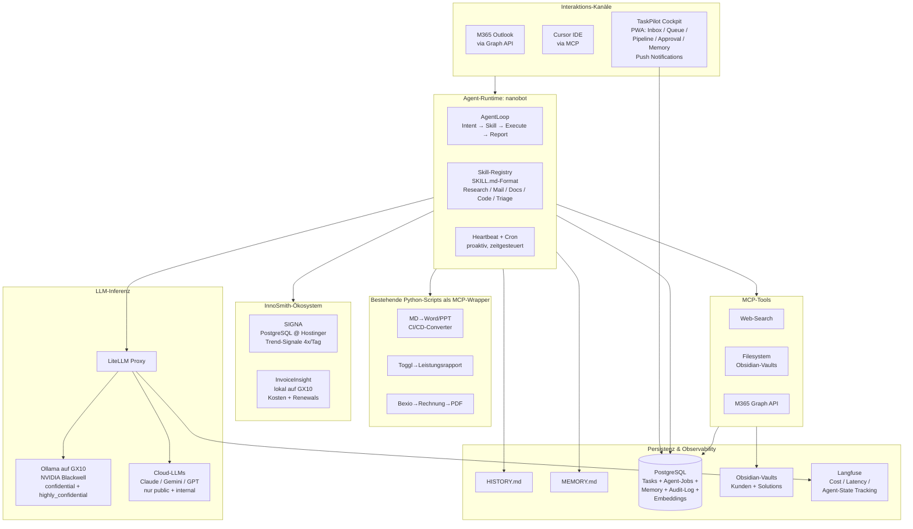

# Pflichtenheft — InnoSmith TaskPilot

> **Version:** 0.12  
> **Datum:** 25. April 2026  
> **Autor:** InnoSmith (mit Cursor-AI-Co-Pilot)  
> **Status:** Konzeptphase — Architektur-Kern verifiziert, Cockpit-Frontend entschieden (React + FastAPI + @dnd-kit)

---

## Inhaltsverzeichnis

1. [Zusammenfassung](#1-zusammenfassung)
2. [Ausgangslage & täglicher Workflow](#2-ausgangslage--täglicher-workflow)
3. [Vision & Leitprinzipien](#3-vision--leitprinzipien)
4. [Szenarien](#4-szenarien)
5. [Funktionale Anforderungen](#5-funktionale-anforderungen)
6. [Nicht-funktionale Anforderungen](#6-nicht-funktionale-anforderungen)
7. [Architektur](#7-architektur)
8. [Roadmap](#8-roadmap)
9. [Realistische Einschätzung & Grenzen](#9-realistische-einschätzung--grenzen)
10. [Offene Fragen](#10-offene-fragen)
11. [Risiken](#11-risiken)
12. [Glossar](#12-glossar)

---

## 1. Zusammenfassung

**InnoSmith TaskPilot** ist ein AI-Agent-System, das als **virtuelles Teammitglied** neben dem Berater arbeitet. Der Berater und seine Agenten bilden ein Team: Der Berater ist **Orchestrator**, entscheidet über Aufgaben-Zuweisung und Qualität — führt aber auch selbst aus. Anstatt einem menschlichen Mitarbeiter eine Aufgabe zuzuweisen ("Recherchiere X", "Analysiere dieses Meeting-Protokoll", "Erstelle Offerte Y"), delegiert er an seinen Agenten.

**Das Kernproblem:** Zwei entkoppelte Welten — die **Inbox** (die den Tag diktiert) und das **Task-Board** (das die Woche plant). Klassische Kanban-Tools (MeisterTask, Trello, Plane) wurden für Menschen gebaut und haben kein Konzept von Agent-Lifecycle, Approval-Workflows oder LLM-Routing. TaskPilot löst das mit einem **eigenen agentischen Cockpit** — einer purpose-built Web-UI für Mensch-Agent-Zusammenarbeit, die Inbox-Triage, Agent-Queue, Cross-Project-Planung und Approval-Review vereint.

**Drei Zwecke:**
1. **Persönliches Productivity-Werkzeug** — nicht nur Planung, sondern aktive Ausführung durch den Agenten
2. **Lernprojekt für Agentic AI 2026** — praktischer Erprobungsraum für Agent-Frameworks, Memory, MCP, Multi-LLM-Routing
3. **Demo-Asset für InnoSmith** — zeigt Kunden, was datenschutzkonform mit Agentic AI möglich ist

**Arbeitsmodell:** Der Berater entscheidet pro Aufgabe, ob er sie selbst bearbeitet, dem Agenten zuweist, oder gemeinsam mit dem Agenten erledigt. Bei der Zuweisung bestimmt er auch, **welches LLM** der Agent nutzen soll — analog zur Modellwahl in Cursor. Externe Kommunikation (Kunden, Lieferanten) durchläuft immer ein Human-Review.

### Entscheidungs-Stack v0.12

| Schicht | Entscheidung | Status |
|---------|-------------|--------|
| **Agent-Runtime** | **nanobot** v0.1.5 (HKUDS, MIT, ~3.7K LOC Kern, 40K+ Stars, 240 Contributors) | **Verifiziert** — MCP, Dream Memory, Heartbeat, Cron, Subagent nativ eingebaut |
| **Task-Board / Cockpit** | **Eigenes agentisches Cockpit:** React 19 (Vite) + Tailwind CSS + @dnd-kit als Frontend, FastAPI + SQLModel als Backend-API, SSE für Real-Time, PostgreSQL als Datenbank. Code wird vollständig AI-generiert (Cursor/Claude Code/Codex). MeisterTask Pro läuft parallel als Safety-Net, bis das Cockpit es ablöst. Fallback: NiceGUI (Python-only) | **Entschieden** |
| **LLM lokal** | Ollama auf ASUS GX10 (NVIDIA Blackwell, 128 GB Unified Memory) | **Verifiziert** — produktiv im Einsatz, diverse Modelle erprobt |
| **LLM Cloud** | Anthropic, OpenAI, Gemini APIs (nach Datenklasse geroutet) | **Verifiziert** — API-Keys aktiv |
| **LLM-Gateway** | LiteLLM-Proxy — nanobot verbindet sich als OpenAI-kompatibler Client; per-Task Model-Override via LiteLLM-Aliase | **Verifiziert** |
| **Memory** | Dream Memory (HISTORY.md + MEMORY.md) + PostgreSQL + pgvector (Phase 2) | Bestätigt |
| **Observability** | Langfuse (Open Source, Self-Hosted) — Cost/Latency/State-Dashboard, LiteLLM-kompatibel | **Neu** — Phase 2 |
| **Safety Phase 1** | MCP-Tool-Allowlist + System-Prompt-Constraints | Vereinfacht |
| **Workflow** | Kein LangGraph — nanobot AgentLoop; eigene LangChain-Erfahrung bestätigt: zu komplex | **Entschieden** |
| **Multi-Agent** | Formal zurückgewiesen (CrewAI/AutoGen) | Entschieden |
| **Tool-Integration** | MCP (Model Context Protocol) — nanobot ist MCP-Client seit v0.1.4 | Bestätigt |
| **Messenger** | **Kein externer Messenger.** Stattdessen PWA Push Notifications via Cockpit (Web Push API). Telegram verworfen: Bot-Nachrichten nicht E2E-verschlüsselt, Server in Dubai (kein DSGVO/revDSG-Angemessenheitsbeschluss), untergräbt lokale Datenschutzstrategie. Cockpit wird mobile-friendly für Quick-Capture und Approvals | **Entschieden** — Telegram verworfen |
| **Agent-Skills** | SKILL.md-Format (Markdown, versioniert in Git, Progressive Disclosure) | **Neu** — Standard-Format gemäss Research |
| **Business-Tools** | Bexio, Toggl Track, Runn — Lazy-Add via MCP (Phase 2–3) | Bestätigt |
| **InnoSmith-Ökosystem** | SIGNA (read-only, PostgreSQL @ Hostinger) + InvoiceInsight (lokal auf GX10) | Bestätigt |
| **Deployment** | 3-Stufen: Dev (lokal ohne Docker) → Staging (Docker Compose) → Prod (Docker Compose auf GX10). Zugang via Cloudflare Tunnel | **Entschieden** |
| **Auth & User Management** | E-Mail + Passwort + Magic Link, JWT-Sessions, Cloudflare Zero Trust als vorgelagerter Schutz. Drei Rollen: owner / member / viewer. Board-Level-Sharing für Gäste | **Entschieden** |
| **Backup** | pg_dump (täglich, GPG-verschlüsselt), Memory via Git, Docker Volumes wöchentlich. Quartalsweiser Restore-Test | **Entschieden** |

---

## 2. Ausgangslage & täglicher Workflow

### 2.1 Heutige Arbeitsweise

**Task-Planung & Projektmanagement:**
- **MeisterTask Pro** für Kanban-Planung (10–14 parallele Projekte), Cross-Project-Pipeline (Focus → This Week → Next Week → Waiting for Feedback → This Month → Next Month → Beyond), Recurring Tasks. **Wird mittelfristig durch TaskPilot Cockpit abgelöst** — parallel-Betrieb in Phase 1
- **MindMeister** (selbe Firma) für MindMaps bei komplexen Themen → daraus abgeleitet Kanban-Tasks
- **Miro** für Whiteboard-Aufgaben (Workshops, Visualisierungen)

**Dokument-Erstellung & -Bearbeitung (Markdown-First-Pipeline):**
- **Obsidian** als Markdown-Editor (nicht als Wissensmanagement-System). Zwei Vaults:
  - Kunden-Vault (Root-Verzeichnis via OneDrive synchronisiert)
  - Solutions-Vault (Dokumentation des eigenen Lösungsportfolios)
- **Cursor** für AI-gestütztes Lesen, Schreiben, Editieren von Markdown und Code
- **Eigener Markdown→Word/PPT-Converter** (Python-Script): generiert aus Markdown-Files template-basiert kundenspezifische Word- oder PowerPoint-Dokumente gemäss CI/CD-Vorgaben. Wird eingesetzt für Konzepte, Pflichtenhefte, Schulungsunterlagen (häufige Unterrichtstätigkeit).
- **Microsoft Office** (Word, Excel, PowerPoint) — täglicher Einsatz für Kunden-Deliverables

**Kommunikation:**
- **Outlook** (M365 Business) für geschäftliche E-Mails; Copilot kategorisiert Inbox (Wichtig, Finanzen, Newsletter etc.)
- **Slack** — selten, mit wenigen Personen
- Private E-Mails über separates System (nicht Teil von TaskPilot)

**Finanzen & Zeiterfassung (bereits teilautomatisiert):**
- **Toggl Track** für Zeit-/Leistungserfassung (seit Jahren, sehr zufrieden)
- **Bexio** für Buchhaltung und Rechnungsstellung
- **Eigene Python-Workflows** (manuell angestossen, hoher Automatisierungsgrad):
  - Toggl Track → Leistungsrapport als PDF (CI/CD-konform)
  - Bexio → Rechnung erstellen → PDF-Export
  - E-Mail mit Rechnung + Leistungsrapport vorbereiten (nur noch Empfänger/Inhalt prüfen und absenden)

**LLM-Inferenz:**
- **Ollama auf ASUS GX10** (NVIDIA Blackwell, 128 GB) für lokale Inferenz bei sensitiven Daten
- **Cloud-LLM-APIs** (Anthropic, OpenAI, Gemini) für nicht-sensitive, anspruchsvolle Aufgaben

**Eigene AI-Lösungen (InnoSmith-Ökosystem):**
- **InnoSmith SIGNA** — selbstentwickeltes, n8n-basiertes Strategic-Intelligence-System. Synthetisiert 4x täglich weltweite Signale (RSS-Feeds, YouTube-Transkripte, Custom-Webseiten), bewertet sie per Persona/Topic-Scoring (Score ≥7 = relevant), liefert Deep-Synthesis-Briefings und KI-Podcasts. Läuft bei Hostinger.com (Frankfurt, DSGVO), Daten in PostgreSQL. Themen: AI-Agenten, AI Governance, Agentic Workflows, Local AI. Ist gleichzeitig Produkt für Kunden (Container-per-Tenant).
- **InvoiceInsight** — lokale KI-Lösung für Software-Portfolio-Analyse und Kosten-Monitoring. Läuft auf derselben GX10 wie TaskPilot. Proaktives Erneuerungs-Radar (30/60/90 Tage vor Vertragsverlängerungen), automatische Kategorisierung (Software, AI/LLM, Hosting, Hardware), Anomalie-Erkennung. 100% Privacy-First, liest Belege via Bexio-API oder Filesystem.

Zusätzlich existieren **ImpactPilot** (Projektportfolio-Cockpit) und **BidSmarter** (Opportunity-Matching) als Kunden-Lösungen — für TaskPilot nicht direkt relevant, aber Teil des Gesamtportfolios.

### 2.2 Bestehende Automatisierung — was TaskPilot NICHT neu bauen muss

Bereits heute existieren funktionierende, manuell angestossene Workflows mit hohem Automatisierungsgrad:

| Workflow | Ablauf heute | Was TaskPilot dazu beitragen kann |
|----------|-------------|----------------------------------|
| **Monatsabschluss** (Rechnungen) | Leistungen in Toggl prüfen → Python-Script → Leistungsrapport PDF → Bexio-Rechnung → PDF-Export → Mail vorbereiten → manuell prüfen → versenden | Agent stösst Workflow zum richtigen Zeitpunkt an, prüft Plausibilität, bereitet Mail vor → Berater bestätigt und löst Versand aus |
| **Kunden-Dokumentation** | Markdown schreiben (Cursor/Obsidian) → Python-Converter → Word/PPT (CI/CD) | Agent erstellt Markdown-Entwurf → Berater reviewt → Converter erzeugt CI/CD-Dokument |
| **Schulungsunterlagen** | Markdown-Inhalte erstellen → Converter → PowerPoint | Agent unterstützt bei Inhaltserstellung (Research, Strukturierung) |

**Architektonische Konsequenz:** TaskPilot orchestriert bestehende Scripts und Workflows — es ruft Python-Scripts über MCP-Tools oder Shell-Kommandos auf. Die bewährten Automatisierungen bleiben intakt.

### 2.3 Das Zwei-Welten-Problem

**Die Inbox bestimmt oft den Tag statt das Task-Board.** Die wöchentliche Kanban-Planung (montags, sofern die Zeit reicht) wird durch die laufende Mail-Flut unterlaufen. Ergebnis: reaktives Arbeiten statt geplantes.

Nicht jede eingehende Mail ist eine echte Aufgabe:
- **Quick Response (<15 Min)** — braucht keine Kanban-Karte, nur eine schnelle Antwort
- **Bedenkzeit nötig** — muss geparkt und erinnert werden
- **Tiefe Aufgabe** — gehört ins Board mit Checkliste und Deadline
- **FYI / Newsletter** — braucht gar nichts

Heute fehlt die Verbindung: weder fliesst die Inbox automatisch ins Board, noch weiss das Board von eingehenden Mails. TaskPilot löst dieses Problem.

### 2.4 Schmerzpunkte

| Problem | Auswirkung |
|---------|-----------|
| **Inbox und Board sind entkoppelt** | Mail-Flut überrollt Wochenplanung, reaktives statt geplantes Arbeiten |
| Keine automatische Mail-zu-Task-Brücke | Vergessene Aufgaben, manueller Pflegeaufwand |
| Bestehende Automatisierungen sind "Inseln" | Workflows funktionieren, aber werden manuell angestossen und sind nicht mit dem Task-Board verknüpft |
| Kein intelligenter Orchestrator | Niemand erinnert, wann welcher Workflow fällig ist — ausser der Berater selbst |
| Keine Lernfähigkeit | Tools werden über Jahre nicht "klüger" |
| Mobile-Eingabe umständlich (Self-Mail) | Friktion unterwegs |

### 2.5 Was selten bis nie gebraucht wird

- **Gantt-Charts** — höchst selten, und wenn, nur für visuell hübsche Kunden-Roadmaps (nicht für Planung)
- **Komplexe Team-Kollaboration** — TaskPilot ist ein Einzelnutzer-System (Ein-Mann-Firma, mit wachsender Agent-Unterstützung)
- **Time-Tracking als Kernfunktion** — wird durch Toggl Track abgedeckt; TaskPilot stösst allenfalls Toggl-Workflows an

### 2.6 Strategische Vision

Ziel ist eine Ein-Mann-Firma, die mit zunehmend leistungsfähigeren Agenten ihre Kapazität skaliert — ohne zusätzliche Mitarbeiter. Tätigkeitsspektrum: Beratung, Schulung, Entwicklung, Überwachung und Wartung von Software. TaskPilot ist das System, das diese Skalierung ermöglicht.

---

## 3. Vision & Leitprinzipien

> *"Ich und meine Agenten sind ein Team. Ich bin der Orchestrator — aber auch Ausführender. Anstatt einem realen Mitarbeiter eine Aufgabe zuzuweisen, weise ich sie meinem Agenten zu: 'Recherchiere X', 'Analysiere dieses Protokoll', 'Erstelle Offerte Y'. Und ich bestimme, wie die Aufgabe erledigt wird."*

| # | Prinzip | Konkretisierung |
|---|---------|----------------|
| 1 | **Team-Modell** | Agent = virtueller Mitarbeiter; Berater = Orchestrator, QA-Instanz, und teilweise Ausführender |
| 2 | **Aufgaben-Delegation** | Berater weist Tasks explizit zu: an sich selbst, an den Agenten, oder als Zusammenarbeit |
| 3 | **LLM-Kontrolle pro Task** | Berater bestimmt pro Aufgabe, welches LLM verwendet wird (Datenschutz, Qualitätsanspruch, Kosten) — wie die Modellwahl in Cursor |
| 4 | **HITL für Externe** | Alles, was an Kunden oder Lieferanten geht, durchläuft menschliche Prüfung — ausnahmslos |
| 5 | **Datenschutz-Souveränität** | Sensitive Daten bleiben lokal (Ollama auf GX10); Cloud nur für public/internal |
| 6 | **Markdown-First** | Alles, was der Agent produziert, ist Markdown — kompatibel mit Obsidian, Cursor, git |
| 7 | **Lernend** | Agent lernt Gewohnheiten, Entscheidungsmuster und Domänenwissen — messbar besser über die Zeit |
| 8 | **Transparenz** | Jede Agentenaktion erklärbar, auditierbar, rückgängig machbar |
| 9 | **Einfachheit** | So wenige Komponenten wie möglich; Wartung muss mit 4–6h/Monat machbar sein |
| 10 | **No-Code-Bedienung + agentische Steuerung** | Das Cockpit funktioniert wie MeisterTask/Trello: Projekte anlegen, Spalten konfigurieren, Tasks erstellen/editieren/verschieben — alles rein über die UI, ohne Code-Änderungen. Gleichzeitig kann der Agent dieselben Operationen programmatisch ausführen (via FastAPI). Mensch und Agent arbeiten auf derselben Datenbasis (PostgreSQL) und sehen jederzeit denselben Stand |

**Anti-Prinzipien:** Kein SaaS-Lock-in. Kein klassisches Kanban-Backend (Paradigmen-Entscheid v0.9). Kein AI-Feature-Creep. Kein LangGraph oder Multi-Agent-Framework. n8n nicht als Agent-Kern, aber pragmatisch nutzbar für deterministische Pipelines.

---

## 4. Szenarien

### A — Wochenplanung am Montagmorgen
Agent zeigt konsolidierte Sicht: vorklassifizierte neue Tasks aus Inbox, überfällige Tasks, offene Agent-Anfragen. Berater bestätigt/korrigiert. Agent reorganisiert Pipeline. 15–20 statt 45–60 Minuten.

### B — Mail-Triage mit automatischer Bearbeitung
Kunde schickt Mail → CoPilot kategorisiert → Agent liest Kategorie → **Quick Response (<15 Min):** Agent entwirft Antwort, Berater bestätigt mit 1 Klick → **Tiefe Aufgabe:** Agent erstellt Task im Board mit Projekt, Checkliste, Deadline → **FYI:** Agent archiviert, kein Task.

### C — Agent führt Research-Aufgabe aus
Berater erstellt Task "Recherchiere aktuelle Pricing-Modelle für AI-Beratung DACH" → Agent nutzt Web-Search, synthetisiert Ergebnisse in einem Markdown-Dokument → legt es in Obsidian-Vault ab → meldet Fertigstellung via Cockpit Push Notification → Berater reviewt und gibt Feedback.

### D — Agent schreibt Dokument
Berater erstellt Task "Erstelle Offerte für Kunde X basierend auf Vorlage Y" → Agent liest Vorlage aus Obsidian, füllt kundenspezifische Teile via RAG-Kontext → erzeugt Markdown-Entwurf → Berater reviewt in Cursor/Obsidian → Feedback fliesst in Memory.

### E — Mobile Quick-Capture
Berater öffnet Cockpit auf dem Smartphone, tippt "Erinnere mich an Offerte Smith" → Agent klassifiziert, erstellt Task, bestätigt per Push Notification zurück.

### F — Wiederkehrende Admin-Tasks
Cron-Trigger am 25. → Agent erzeugt "Lohn-Lauf" mit Checkliste → prüft historische Anpassungen → schlägt Updates vor.

### F2 — Monatsabschluss (Rechnungen + Leistungsrapporte)
Monatsende → Agent erinnert an fällige Monatsabschlüsse → prüft offene Toggl-Einträge auf Plausibilität → stösst bestehendes Python-Script an (Toggl→Leistungsrapport PDF) → stösst Bexio-Script an (Rechnung erstellen, PDF exportieren) → bereitet E-Mail mit Anhängen vor → Berater prüft Empfänger, Betrag und Rechnung → bestätigt → Agent sendet.

### G — Re-Priorisierung im Tagesverlauf
11:42 trifft dringende Mail ein → Heartbeat erkennt: harte Deadline + freier Kalender-Slot → Agent schlägt Re-Priorisierung via Push Notification vor → Berater bestätigt im Cockpit mit 1 Klick → Agent entwirft Antwort.

### H — Agent unterstützt beim Code
Berater delegiert Task "Implementiere MCP-Server für Toggl-Integration" → Agent erzeugt Code-Skeleton in Markdown/Python → legt es im Repo ab → Berater reviewt in Cursor.

### I — Neukunden-Onboarding (administrative Checkliste)
Neues Mandat gewonnen → Berater erstellt Task "Neukunde: Firma ABC einrichten" → Agent erzeugt Onboarding-Checkliste mit vorausgefüllten Werten:
- [ ] Kontakt in Bexio erstellen (Firma, Ansprechpartner, Adresse)
- [ ] Draft-Rechnung in Bexio anlegen
- [ ] Kunde in Toggl Track einrichten
- [ ] Projekt in Toggl anlegen
- [ ] Kunde + Projekt in Runn erfassen (Kapazitätsplanung)
- [ ] Projekt-Board im Kanban erstellen

**Phase 2:** Agent füllt Werte vor und erstellt Checkliste. **Phase 3:** Agent führt einzelne Schritte via API selbst aus (Bexio, Toggl), wo API vorhanden und zuverlässig. Schritte ohne API (Runn, falls API fehlt) bleiben auf der Checkliste für manuelle Bearbeitung.

### J — Berater und Agent arbeiten gemeinsam
Berater beginnt Strategiepapier selbst in Obsidian → kommt an einen Punkt, wo Marktdaten fehlen → weist dem Agenten zu: "Recherchiere aktuelle Marktgrösse für AI-Beratung Schweiz 2025/2026, lokales Modell reicht" → Agent recherchiert mit Ollama → liefert Markdown-Baustein → Berater integriert ihn ins Dokument.

### K — SIGNA-Signale erzeugen Aufgaben
SIGNA-Heartbeat (4x täglich) liefert neuen Trend mit Score ≥8 (z.B. "EU AI Act: neue Guidance für KMU-Beratung veröffentlicht") → Agent liest Signal aus SIGNA-PostgreSQL → erkennt Relevanz für laufende Kundenprojekte → erstellt Task "AI-Act-Update in Schulungsunterlage Kunde Z einarbeiten" → Berater prüft und priorisiert. Alternativ: Berater fragt "Was wissen wir über Local AI Trends Q1 2026?" → Agent durchsucht SIGNA-Wissensbasis → synthetisiert Antwort aus gespeicherten Signalen.

### L — InvoiceInsight-Warnung erzeugt Aufgabe
InvoiceInsight meldet: "Anthropic API-Abo verlängert sich in 30 Tagen, Kosten +40% gegenüber Vorjahr" → Agent erstellt Task "Anthropic-Abo prüfen: Nutzung vs. Kosten vs. Alternativen" mit Kontext aus InvoiceInsight (Kostenentwicklung, Nutzungsstatistik) → Berater entscheidet.

---

## 5. Funktionale Anforderungen

> **MUST** = Phase 1, **SHOULD** = Phase 2, **COULD** = Phase 3+

### 5.1 TaskPilot Cockpit (eigene Web-UI, ersetzt klassisches Kanban-Backend)

> **Paradigmen-Entscheid:** Kein klassisches Task-Management-Tool (MeisterTask, Plane, Vikunja) als Backend. Stattdessen ein purpose-built Cockpit für Mensch-Agent-Zusammenarbeit, direkt auf PostgreSQL. MeisterTask läuft parallel als Safety-Net, bis das Cockpit es vollständig ablöst.  
> **Begründung:** Siehe [Analyse Task-Management-Paradigma v2](analyse-task-management-paradigma.md)  
> **Referenz-Screenshots:** `assets/SCR-20260425-tljh*.png` (Agenda), `SCR-20260425-tlks*.png` (Projekte), `SCR-20260425-tlmf*.png` (Board), `SCR-20260425-tlpt*.png` (Task-Detail)

**Dual-Mode-Prinzip:** Das Cockpit muss vollständig **No-Code bedienbar** sein — wie MeisterTask oder Trello. Projekte anlegen, Board-Spalten konfigurieren, Tasks erstellen, editieren, verschieben, Checklisten abhaken, Tags setzen, Recurring Tasks definieren: alles rein über die Web-UI. Gleichzeitig kann der **Agent dieselben Operationen programmatisch** über die FastAPI ausführen: Tasks erstellen, Status ändern, Outputs anhängen, Pipeline-Positionen verschieben. Mensch und Agent arbeiten auf derselben PostgreSQL-Datenbasis und sehen in Echtzeit (SSE) denselben Stand.

#### 5.1.1 Agenda — Cross-Project-Pipeline (das Killer-Feature)

Die heutige MeisterTask-Agenda dient als exakte Vorlage: **projektübergreifende Priorisierung nach Zeithorizont**, ohne dass jeder Task zwingend ein Datum braucht. Zeigt nur Tasks, bei denen der User im Lead ist (Assignee = Ich oder Gemeinsam).

| Spalte | Bedeutung | Typ |
|--------|-----------|-----|
| **Focus** | Heute/jetzt bearbeiten, mit Pin-Bereich für angepinnte Tasks | Aktiv |
| **This Week** | Diese Woche erledigen | Geplant |
| **Next Week** | Nächste Woche | Geplant |
| **Waiting for Feedback** | Blockiert — wartet auf externe Antwort oder Agent-Ergebnis | Parkiert |
| **This Month** | Diesen Monat | Horizont |
| **Next Month** | Nächsten Monat | Horizont |
| **Beyond** | Irgendwann / Backlog | Horizont |

**Wichtig:** Das ist keine starre Zustandsmaschine, sondern eine **flexible Priorisierungssicht** über 10+ Projekte. Tasks bewegen sich frei zwischen Spalten per Drag-and-Drop. Einige Tasks haben Deadlines, die meisten nicht — die Position in der Pipeline *ist* die Priorisierung.

**Task-Card in der Agenda** (kompakte Darstellung):

- Farbiger Projekt-Indikator (linker Rand oder Badge mit Projektfarbe)
- Projektname als Label
- Task-Titel (einzeilig, mit Ellipsis bei Überlänge)
- Fälligkeitsdatum (wenn gesetzt), **rot markiert bei Überfälligkeit** mit Label "Überfällig"
- Checklisten-Fortschritt als Kompakt-Anzeige (z.B. "3/7")
- Assignee-Avatar (klein)
- Klick öffnet Task-Detail-Dialog (siehe 5.1.4)

| ID | Anforderung | Prio |
|----|-------------|------|
| FA-1 | **Cross-Project-Pipeline** mit 7 Zeithorizont-Spalten (Focus → Beyond) — projektübergreifend, zeigt nur eigene Tasks | MUST |
| FA-1a | **Pin-Bereich** in der Focus-Spalte: Tasks können angepinnt werden, um sie visuell hervorzuheben | SHOULD |
| FA-1b | **Spalten-Konfiguration:** Anzahl, Namen und Reihenfolge der Spalten anpassbar (Default: die 7 MeisterTask-Spalten) | SHOULD |
| FA-3 | **Drag-and-Drop** zwischen allen Spalten — Task behält seine Projekt-Zugehörigkeit, nur die Pipeline-Position ändert sich | MUST |
| FA-3a | **Cross-Project-DnD:** Tasks können auch zwischen Projekten verschoben werden (Projekt-Zugehörigkeit ändern) | SHOULD |

#### 5.1.2 Projekte-Übersicht

Listenansicht aller Projekte mit Metriken — vergleichbar mit MeisterTask's Projekte-Seite.

**Sidebar (links, persistent über alle Ansichten):**
- Navigationsleiste: Agenda / Projekte / Inbox / Agent-Queue / Approvals
- Projektliste mit Farbpunkt und Projektname
- Neues Projekt erstellen (+)
- Projekte archivieren/reaktivieren

**Hauptbereich — Projekt-Tabelle:**

| Spalte | Inhalt |
|--------|--------|
| Projektname | Name + Farbindikator |
| Fortschritt | Prozent abgeschlossener Tasks |
| Offene Aufgaben | Anzahl offener Tasks |
| Überfällige | Anzahl überfälliger Tasks (rot) |
| Priorität | Projekt-Priorität (konfigurierbar) |
| Status | Aktiv / Archiviert / Pausiert |

| ID | Anforderung | Prio |
|----|-------------|------|
| FA-6a | **Projekte-Übersicht** als Tabelle mit Metriken (offene Tasks, überfällige, Fortschritt) | MUST |
| FA-6b | **Projekt erstellen/bearbeiten:** Name, Farbe, Beschreibung, Hintergrundbild, Custom-Spalten für das Kanban-Board | MUST |
| FA-6c | **Projekt archivieren/reaktivieren** — archivierte Projekte verschwinden aus Sidebar und Agenda, bleiben aber in DB | MUST |

#### 5.1.3 Projekt-Kanban-Board

Klassische Board-Ansicht pro Projekt — wie MeisterTask's Projektansicht. Jedes Projekt hat **eigene, frei konfigurierbare Spalten** (nicht die Zeithorizont-Spalten der Agenda).

**Beispiel InnoSmith-Projekt:** Admin | Geschäftsmodell | Marketing | Weiterbildung | Tools | ...

**UI-Elemente:**
- **Hintergrundbild** pro Projekt (Unsplash-Integration oder eigener Upload) — macht die Planung visuell angenehm
- Spalten mit farbigem Header und Task-Count-Badge
- Task-Cards (gleiche Kompakt-Darstellung wie in Agenda, plus Projekt-spezifische Labels)
- Drag-and-Drop zwischen Spalten innerhalb des Projekts
- "Nicht zugeordnet"-Spalte (Eingang) und "Archiv"-Spalte (am rechten Rand, eingeklappt)
- Spalten frei hinzufügbar, umbenennbar, umsortierbar, löschbar

| ID | Anforderung | Prio |
|----|-------------|------|
| FA-6 | **Filterbare Ansicht** pro Projekt (Kanban-Board) **und** projektübergreifend (Agenda-Pipeline) — zwei Hauptansichten | MUST |
| FA-6d | **Custom-Spalten pro Projekt:** Jedes Projekt definiert eigene Board-Spalten (Name, Farbe, Reihenfolge). Default: "Offen / In Arbeit / Erledigt" | MUST |
| FA-6e | **Hintergrundbild pro Projekt:** Auswahl aus Unsplash-Galerie oder eigener Upload. Wird hinter den Kanban-Spalten angezeigt (halbtransparente Spalten) | SHOULD |
| FA-6f | **Archiv-Spalte:** Abgeschlossene Tasks wandern ins Archiv (eingeklappt am rechten Rand). Archiv durchsuchbar | MUST |
| FA-6g | **Board-Filter:** Nach Assignee (Ich / Agent / Alle), Tags, Fälligkeit (überfällig / diese Woche / ohne Datum) | MUST |

#### 5.1.4 Task-Datenmodell & Detail-Dialog

Jeder Task lebt in genau einem Projekt und in genau einer Board-Spalte. Zusätzlich hat er optional eine Position in der Agenda-Pipeline (Zeithorizont). Der Detail-Dialog öffnet sich als Modal/Overlay über dem Board oder der Agenda.

**Task-Attribute (Kern — MeisterTask-Parität):**

| Attribut | Beschreibung | Pflicht |
|----------|-------------|---------|
| Titel | Einzeiliger Task-Name | Ja |
| Beschreibung | Freitext, **Markdown-fähig** (nicht nur Plain-Text wie bei MeisterTask) | Nein |
| Projekt | Zugehörigkeit zu genau einem Projekt | Ja |
| Board-Spalte | Position im Projekt-Kanban | Ja |
| Pipeline-Spalte | Position in der Agenda (Focus → Beyond), optional | Nein |
| Checkliste | Geordnete Liste von Einträgen mit Checkbox, Fortschrittsanzeige (z.B. "3/7") | Nein |
| Fälligkeit (Due Date) | Optionales Datum, **rot markiert bei Überfälligkeit** | Nein |
| Tags | Frei definierbare, farbige Labels (z.B. BUSINESS, URGENT, Projektname) | Nein |
| Assignee | Wer ist zuständig: **Ich / Agent / Gemeinsam** (erweitert gegenüber MeisterTask) | Ja (Default: Ich) |
| Anhänge | Dateien an Task hängen (Upload oder Link) | Nein |
| Unteraufgaben | Verknüpfte Sub-Tasks (mit eigenem Status) | Nein |
| Beobachter | Wer wird über Änderungen benachrichtigt | Nein |
| Aktivitäts-Log | Chronologischer Feed aller Änderungen und Kommentare | Automatisch |
| Erstellt / Geändert | Timestamps | Automatisch |

**Task-Attribute (TaskPilot-Erweiterungen — über MeisterTask hinaus):**

| Attribut | Beschreibung | Pflicht |
|----------|-------------|---------|
| Datenklasse | public / internal / confidential / highly_confidential | Ja (Default: internal) |
| LLM-Override | Welches Modell soll der Agent nutzen (z.B. "Claude", "lokales Modell") | Nein |
| Autonomie-Stufe | L0 Block / L1 Approve / L2 Notify / L3 Auto | Ja (Default: L1) |
| Agent-Status | queued / running / awaiting-approval / completed / failed (nur bei Agent-Tasks) | Automatisch |
| Agent-Output | Ergebnis des Agenten: Markdown-Dokument, Mail-Entwurf, etc. — inline im Detail-Dialog reviewbar | Automatisch |

**Detail-Dialog Layout** (Modal über Board/Agenda):

```
┌─────────────────────────────────────────────────────────────┐
│ [✓ Aufgabe abschließen]    Assignee: [Ich ▼]    [⋯] [✕]   │
├────────────────────────────────────┬────────────────────────┤
│                                    │ Fälligkeit: [nicht     │
│ Titel (editierbar, gross)          │   gesetzt / Datum]     │
│ Beschreibung (Markdown-Editor)     │                        │
│                                    │ Tags: [+ Tag]          │
│ ▸ Checkliste (N/M)                 │   [BUSINESS] [URGENT]  │
│   ☐ Item 1                         │                        │
│   ☑ Item 2                         │ Datenklasse: [intern▼] │
│   ☐ Item 3                         │ LLM: [Default ▼]      │
│   [+ Eintrag hinzufügen]           │ Autonomie: [L1 ▼]     │
│                                    │                        │
│ ▸ Agent-Output (wenn vorhanden)    │ Beobachter: [Avatars]  │
│   [Markdown-Preview des Outputs]   │                        │
│   [Genehmigen] [Editieren]         │ Abhängigkeiten: [+]    │
│   [Ablehnen mit Feedback]          │                        │
│                                    │ Wiederholung: [keine▼] │
│ ▸ Unteraufgaben (N erledigt)       │                        │
│   [+ Unteraufgabe hinzufügen]      │ Projekt: [Name ▼]     │
│                                    │ Verschieben: [Spalte▼] │
│ ▸ Anhänge                          │                        │
│   [+ Anhang hinzufügen]            │                        │
│                                    │                        │
│ ─── Aktivität ───                  │                        │
│ Kommentar-Eingabe                  │                        │
│ 25. Apr 2026 10:30 — Erstellt      │                        │
│ 25. Apr 2026 11:00 — Checkliste +  │                        │
└────────────────────────────────────┴────────────────────────┘
```

| ID | Anforderung | Prio |
|----|-------------|------|
| FA-2 | **Task-Datenmodell** mit allen Kern-Attributen (Titel, Beschreibung/Markdown, Checkliste, Tags, Fälligkeit, Assignee, Anhänge, Unteraufgaben, Beobachter, Aktivitäts-Log) + TaskPilot-Erweiterungen (Datenklasse, LLM-Override, Autonomie-Stufe, Agent-Status, Agent-Output) | MUST |
| FA-2a | **Checkliste** mit beliebig vielen Einträgen, Drag-and-Drop-Sortierung, Fortschrittsanzeige (N/M), einzeln abhakbar | MUST |
| FA-2b | **Task-Detail-Dialog** als Modal über Board/Agenda mit linkem Hauptbereich (Titel, Beschreibung, Checkliste, Aktivität) und rechter Sidebar (Metadaten: Fälligkeit, Tags, Assignee, etc.) | MUST |
| FA-2c | **Überfälligkeits-Anzeige:** Tasks mit abgelaufenem Due Date erhalten rotes "Überfällig"-Label in allen Ansichten (Agenda, Board, Detail) | MUST |
| FA-2d | **Tags:** Frei definierbare, farbige Labels pro Workspace. Vordefinierte Tags: BUSINESS, URGENT, PERSONAL. Neue Tags inline erstellbar | MUST |
| FA-2e | **Aktivitäts-Log:** Automatischer chronologischer Feed aller Änderungen (Erstellt, Verschoben, Checkliste geändert, Kommentar, Agent-Aktion). Plus manuelle Kommentar-Eingabe | MUST |
| FA-2f | **Anhänge:** Datei-Upload pro Task (gespeichert im Filesystem, Referenz in DB). Bilder inline anzeigbar | SHOULD |
| FA-2g | **Unteraufgaben:** Sub-Tasks mit eigenem Status, verknüpft mit Parent-Task. Badge zeigt "N erledigt" | SHOULD |
| FA-2h | **Abhängigkeiten:** Task A blockiert Task B (einfache Blockiert-durch-Relation) | COULD |
| FA-2i | **Inline Agent-Output-Review:** Wenn der Agent ein Ergebnis liefert (Mail-Entwurf, Dokument), wird es direkt im Detail-Dialog als Markdown-Preview angezeigt, mit Buttons: Genehmigen / Editieren / Ablehnen mit Feedback | MUST |
| FA-2j | **Task verschieben:** Projekt und/oder Board-Spalte direkt im Detail-Dialog änderbar (Dropdown) | MUST |

#### 5.1.5 Recurring Tasks (Wiederholungen)

Exaktes MeisterTask-Verhalten: Recurring Tasks erscheinen automatisch zum definierten Zeitpunkt mit einer Vorlagen-Checkliste. Beispiel: "InnoSmith Weekly" erscheint jeden Montagmorgen mit integrierter Checkliste, kann abgearbeitet, abgeschlossen und archiviert werden.

| ID | Anforderung | Prio |
|----|-------------|------|
| FA-4 | **Recurring Tasks:** Wiederholungsregeln pro Task (täglich / wöchentlich / monatlich / custom Cron). Bei Auslösung wird ein neuer Task aus der Vorlage erstellt (Titel, Beschreibung, Checkliste, Tags, Assignee — alles aus Template) | MUST |
| FA-4a | **Vorlagen-Checkliste:** Recurring Tasks haben eine Template-Checkliste, die bei jeder Instanz frisch (alle unchecked) erstellt wird | MUST |
| FA-4b | **Abschluss-Workflow:** Task abschliessen → wird archiviert → nächste Instanz erscheint zum nächsten Termin automatisch | MUST |
| FA-4c | **Agent-erzeugte Recurring Tasks:** Agent kann Recurring Tasks vorschlagen (z.B. nach Erkennung eines wiederkehrenden Musters). Berater bestätigt | SHOULD |

#### 5.1.6 TaskPilot-spezifische Panels (über MeisterTask hinaus)

| ID | Anforderung | Prio |
|----|-------------|------|
| FA-5 | **Agent-Queue-Panel:** Live-Status aller Agent-Jobs (queued / running / awaiting-approval / completed / failed) mit Fortschritt, Modell, Token-Verbrauch | MUST |
| FA-5a | **Approval-Review-Panel:** Rich Review für Agent-Outputs — Mail-Entwürfe, Dokumente, Checklisten inline lesen, editieren, mit Korrektur-Feedback zurückgeben | MUST |
| FA-5b | **Unified Inbox:** Alle eingehenden Signale (Mail, SIGNA, InvoiceInsight, Agent-Vorschläge) an einem Ort mit Triage-Aktionen | MUST |
| FA-5c | **Memory-Dashboard:** Gelernte Fakten inspizieren, korrigieren, Lern-KPIs (Trefferquoten, Korrekturen/Woche), Kosten-Zusammenfassung | SHOULD |
| FA-5d | **Skills-Overview:** Aktive Skills mit Trefferquoten, Verbesserungstrends | SHOULD |

#### 5.1.7 UI/UX-Grundsätze

| ID | Anforderung | Prio |
|----|-------------|------|
| FA-6h | **Theme: System-Preference als Default** (`prefers-color-scheme`). Tagsüber hell, nachts dunkel — automatisch. Manuell überschreibbar (Light / Dark / System) als User-Einstellung | MUST |
| FA-6i | **Hintergrundbilder:** Pro Projekt wählbar (Unsplash-API oder Upload). Board-Spalten halbtransparent darüber | SHOULD |
| FA-6j | **Responsive Layout:** Desktop-optimiert (primär). **Mobile-friendly für Kernfunktionen:** Quick-Capture, Approval-Buttons, Agenda-Ansicht, Push Notifications. Das Cockpit ersetzt den externen Messenger — daher muss es auf dem Smartphone brauchbar sein, nicht nur am Desktop | MUST |
| FA-6k | **Keyboard-Shortcuts:** Schnelles Navigieren und Task-Erstellen ohne Maus (n = neuer Task, / = Suche, Esc = Dialog schliessen) | SHOULD |
| FA-6l | **Globale Suche:** Tasks, Projekte, Tags durchsuchbar — Volltextsuche über Titel, Beschreibung, Checklisten-Einträge | MUST |

### 5.2 Inbox-Board-Fusion (das Zwei-Welten-Problem lösen)

| ID | Anforderung | Prio |
|----|-------------|------|
| FA-7 | CoPilot-Brücke: liest Mails + deren Kategorisierung via Graph API. **Achtung:** Graph API exponiert `categories` (String-Array) und `inferenceClassification` (focused/other). Ob CoPilots Kategorisierung (Wichtig, Finanzen, Newsletter) als `categories` erscheint oder ein anderer Mechanismus ist, **muss in Phase 0 verifiziert werden.** Falls nicht: Agent klassifiziert selbst (machbar, aber mehr Aufwand) | MUST |
| FA-8 | **Triage-Klassifizierung** pro Mail: Quick Response / Bedenkzeit / Board-Task / FYI — nicht nur "ist das eine Aufgabe?" | MUST |
| FA-9 | **Quick-Response-Fähigkeit:** Agent entwirft kurze Antworten (<15 Min Aufwand), Berater bestätigt mit 1 Klick oder editiert | MUST |
| FA-10 | Konfigurierbares Routing pro CoPilot-Kategorie → Aktion (Task erstellen, antworten, parken, ignorieren) | MUST |
| FA-11 | **Parken mit Erinnerung:** Mails, die Bedenkzeit brauchen, werden geparkt und zum konfigurierten Zeitpunkt erneut vorgelegt | SHOULD |
| FA-12 | Heartbeat-getriggerte Re-Priorisierung: neue Signale werden gegen bestehende Wochenplanung evaluiert | MUST |
| FA-13 | Lern-Loop: Korrekturen an Triage-Entscheidungen fliessen in MEMORY.md | SHOULD |

### 5.3 Task-Ausführung (der Agent als Teammitglied)

Der Agent arbeitet wie ein Mitarbeiter: er bekommt Aufgaben zugewiesen, führt sie aus und liefert Ergebnisse zur Prüfung. Der Berater entscheidet pro Aufgabe:
- **Wer:** Ich selbst / Agent / gemeinsam
- **Wie:** Welches LLM, welche Datenklasse, welcher Detailgrad
- **Wann:** Sofort / eingeplant / nach Abhängigkeit

| ID | Anforderung | Prio |
|----|-------------|------|
| FA-14 | **Skill-Registry:** Definierter Katalog ausführbarer Fähigkeiten (Research, Mail-Entwurf, Dokument-Erstellung, Code-Erstellung, Statusabfrage, Zusammenfassung) | MUST |
| FA-15 | **Research-Skill:** Web-Recherche mit Synthese → Markdown-Dokument als Output | MUST |
| FA-16 | **Mail-Entwurf-Skill:** Antwort oder neue Mail basierend auf Kontext → Approval-Gate vor Versand | MUST |
| FA-17 | **Dokument-Skill:** Erstellung/Ergänzung von Markdown-Dokumenten (Offerten, Konzepte, Berichte) basierend auf Vorlagen und RAG-Kontext | SHOULD |
| FA-18 | **Code-Skill:** Erstellung von Code-Skeletons, MCP-Server-Implementierungen, Scripts → Ablage im Repo | SHOULD |
| FA-19 | **Zusammenfassungs-Skill:** Lange Dokumente/Mail-Threads kondensieren | MUST |
| FA-20 | **Iterativer Refinement-Loop:** Agent produziert Entwurf → Berater gibt Feedback → Agent verbessert → Feedback fliesst in Memory | SHOULD |
| FA-21 | **Job-Queue mit Status:** queued / running / awaiting-approval / completed / failed — pro Task sichtbar | MUST |
| FA-22 | **Langläufer-Management:** Tasks, die Minuten bis Stunden dauern (z.B. Research), laufen im Hintergrund mit Fortschritts-Updates via Cockpit Push Notification | SHOULD |
| FA-23 | **Output-Format:** Alles, was der Agent produziert, ist **Markdown** — kompatibel mit Obsidian-Vault und Cursor | MUST |
| FA-23a | **LLM-Override pro Task:** Berater kann bei Task-Zuweisung das LLM explizit wählen (z.B. "Research mit Claude", "Zusammenfassung mit lokalem Modell"). Default-Routing greift, wenn nichts angegeben | MUST |
| FA-23b | **Meeting-Analyse-Skill:** Transkript/Protokoll → Zusammenfassung + Aktionsliste + Task-Vorschläge | SHOULD |
| FA-23c | **Checklisten-Skill:** Für wiederkehrende administrative Abläufe (z.B. Neukunden-Onboarding) generiert der Agent vorausgefüllte Checklisten basierend auf Memory und Kontext | SHOULD |
| FA-23d | **Workflow-Orchestrierung:** Agent stösst bestehende Python-Scripts und Automationen an (Toggl→Leistungsrapport, Bexio→Rechnung, Markdown→Word/PPT) — über MCP-Tools oder Shell. Die bewährten Scripts bleiben intakt, TaskPilot verkettet und terminiert sie intelligent | SHOULD |
| FA-23e | **Dokument-Pipeline-Skill:** Agent erstellt Markdown-Entwurf → Berater reviewt → Agent ruft den bestehenden Markdown→Word/PPT-Converter auf → CI/CD-konformes Kunden-Dokument entsteht automatisch | SHOULD |

### 5.4 Mobile-Kanal (PWA Push Notifications via Cockpit)

> **Entscheidung:** Kein externer Messenger (Telegram, Threema, WhatsApp).  
> **Begründung:** Telegram Bot-Nachrichten sind nicht E2E-verschlüsselt, Server in Dubai (kein DSGVO/revDSG-Angemessenheitsbeschluss). Das untergräbt die lokale Datenschutzstrategie (highly_confidential auf GX10). Threema Gateway ist kostenpflichtig (pro Nachricht) und hat eine weniger reife Bot-API. Stattdessen: Das Cockpit selbst wird mobile-friendly gestaltet und nutzt **PWA Push Notifications** (Web Push API) für Benachrichtigungen. Alle Daten bleiben auf der GX10 — kein externer Messenger-Server involviert.

| ID | Anforderung | Prio |
|----|-------------|------|
| FA-24 | **Quick-Capture** via mobile-optimiertes Cockpit: schnelles Task-Erstellen (Titel + optional Projekt/Pipeline-Spalte) | MUST |
| FA-25 | **Approval-Anfragen** als PWA Push Notification mit Deep-Link ins Cockpit (Approval-Review-Panel) | MUST |
| FA-26 | **Fortschritts-Updates** für laufende Agent-Jobs als Push Notification | SHOULD |
| FA-27 | **Daily Briefing** als Push (Top-3-Tasks, offene Approvals, Agent-Status) — morgens automatisch | SHOULD |
| FA-28 | Sprachnachrichten → Whisper (lokal auf GX10) → Task-Erstellung — via Cockpit-Mikrofon-Button | COULD |

### 5.5 Agent-Engine (nanobot v0.1.5 — verifiziert)

Alle folgenden Features sind in nanobot nativ vorhanden (verifiziert April 2026, GitHub):

| ID | Anforderung | Prio |
|----|-------------|------|
| FA-29 | nanobot AgentLoop als Kern (Intent-Klassifizierung, Skill-Dispatch, Multi-Iteration) — `agent/loop.py` | MUST |
| FA-30 | Heartbeat-Loop (proaktiv, konfigurierbar) — `heartbeat/` Modul | MUST |
| FA-31 | Cron-Scheduler für zeitgetriggerte Aktionen — `cron/` Modul | MUST |
| FA-32 | MCP-Client (seit v0.1.4, Stdio + HTTP Transport, Auto-Discovery) — `agent/tools/mcp.py` | MUST |
| FA-33 | Subagent-Pattern für komplexe Tasks — `agent/subagent.py` (Background Task Execution) | SHOULD |
| FA-34 | **Kein LangGraph** — eigene Erfahrung (>1 Jahr zurück): zu komplex. nanobot's AgentLoop reicht | MUST |

### 5.6 Autonomie-Modell (4 Stufen + 5 Approval-Patterns)

| Stufe | Bedeutung | Typische Beispiele |
|-------|-----------|-------------------|
| **L0 Block** | Verboten, auch nicht vorbereitend | Finanztransaktionen, Daten löschen, Verträge unterzeichnen |
| **L1 Approve** | Agent bereitet vor, Mensch gibt frei (**Checkpoint**, nicht Escape-Hatch: Agent wartet auf Feedback und arbeitet dann weiter) | Mail-Antworten, Task-Erstellung aus Mail, Dokument-Entwürfe, Code, Bexio-Einträge |
| **L2 Notify** | Agent führt aus, informiert post-hoc (24h Reversibility Window) | Newsletter-Archivierung, FYI-Klassifizierung, Recurring-Task-Erzeugung, Tag-Vorschläge |
| **L3 Auto** | Autonom, nur Audit-Log | Index-Refresh, Heartbeat-Checks, Memory-Consolidation |

**Fünf Approval-Patterns** (aus Cordum/Applied AI Research 2026), nach Aufgabentyp einsetzbar:

| Pattern | Wann einsetzen | Throughput |
|---------|---------------|-----------|
| **Pre-execution Gate** | Externe Kommunikation (immer L1) | Niedrig |
| **Exception Escalation** | Agent ist unsicher (Confidence < Threshold) | Hoch |
| **Graduated Autonomy** | Agent schlägt nach X identischen Korrekturen L2-Erhöhung vor | Mittel |
| **Sampled Audit** | Batch-Tasks (z.B. Toggl-Einträge prüfen) | Sehr hoch |
| **Checkpoint** | Multi-Step-Workflows (z.B. Dokument: Gliederung → Entwurf → Finalisierung) | Mittel |

**Eiserne Regel: Externe Kommunikation = immer L1.** Alles, was an Kunden, Lieferanten oder andere externe Empfänger geht, durchläuft menschliche Prüfung — ausnahmslos. Stand April 2026 ist es zu riskant, einem Kunden eine nicht-geprüfte Mail zu senden. **Ablauf:** Agent entwirft → Berater prüft und bestätigt ("Versenden") → Agent sendet autonom. Der Versand nach Freigabe ist automatisiert — kein erneuter manueller Klick in Outlook nötig. Keine Auto-Eskalation zu L2, auch nach 100 korrekten Mails nicht.

Pro Aufgabentyp und Sub-Bedingung einzeln konfigurierbar. Default für neue Skills: **immer L1**. Auto-Mandat-Vorschlag-Engine: nach X identischen Entscheidungen schlägt Agent Erhöhung vor (nur für interne Aktionen, nie für externe Kommunikation). Jederzeit zurücknehmbar.

### 5.7 Lernfähigkeit & Memory

Das System muss dazulernen — nicht nur Muster, sondern drei Ebenen von Wissen:

1. **Gewohnheiten:** Wie der Berater typischerweise handelt (z.B. "Mails von Kunde X immer priorisieren", "Offerten in dieser Struktur")
2. **Entscheidungen:** Warum der Berater etwas so entscheidet (z.B. "Diesen Kunden immer lokal verarbeiten wegen NDA", "Dieses Thema immer mit Claude")
3. **Domänenwissen:** Fakten über Projekte, Kunden, Abläufe, die der Agent braucht, um gut zu arbeiten (z.B. "Kunde Y hat Budget-Freeze bis Q3", "Rechnungen an öffentliche Verwaltung immer mit ZPV-Nummer")

| ID | Anforderung | Prio |
|----|-------------|------|
| FA-35 | Dream Memory: HISTORY.md (append-only, Session) + MEMORY.md (konsolidiert, Workspace, git-versioniert) | MUST |
| FA-36 | PostgreSQL für strukturierten Audit-Log (append-only, compliance-tauglich) | MUST |
| FA-37 | Daumen-hoch/runter + Korrektur-Detection → fliessen in MEMORY.md | MUST |
| FA-37a | **Korrektur-Kontext:** Bei jeder Korrektur speichert der Agent nicht nur _was_ korrigiert wurde, sondern fragt (optional) _warum_ — diese Begründung ist der wertvollste Memory-Eintrag | MUST |
| FA-38 | Reflection-Loops: Daily (nachts, automatisch), Weekly (Freitag-Zusammenfassung) | SHOULD |
| FA-39 | Few-Shot-Library: gute Agent-Outputs werden als Referenzbeispiele gespeichert und bei ähnlichen Aufgaben als Kontext injiziert | SHOULD |
| FA-40 | **Gewohnheits-Erkennung:** Agent erkennt wiederkehrende Handlungsmuster und schlägt proaktiv vor, diese als Regel zu speichern | SHOULD |
| FA-41 | pgvector + BGE-M3 für semantische Suche über Memory, Tasks, Mails (Phase 2) | SHOULD |
| FA-42 | Tone-of-Voice-Lernen: Agent lernt aus korrigierten Mail-Entwürfen den Stil pro Empfänger-Typ | COULD |

**Realistische Erwartung an das Lernen:** Der Agent wird in den ersten 2–3 Monaten schnell besser, weil er die häufigsten Muster lernt. Danach flacht die Kurve ab. Für wirklich neue Situationen bleibt er auf explizites Briefing angewiesen — wie ein Mitarbeiter, der Standardabläufe beherrscht, aber strategische Entscheide nie alleine trifft.

**Lern-KPIs:** Triage-Trefferquote (steigend), Korrekturen/Woche (sinkend), Approval-Quote ohne Korrektur (steigend), "dumme Fragen"-Quote (→ 0).

### 5.8 Multi-LLM-Routing mit manuellem Override

| ID | Anforderung | Prio |
|----|-------------|------|
| FA-43 | **Default-Routing** pro Aufgabentyp und Datenklasse (public / internal / confidential / highly_confidential) | MUST |
| FA-44 | highly_confidential → immer lokal (Ollama auf GX10) | MUST |
| FA-45 | LiteLLM-Proxy als unified Gateway (alle Provider hinter einem Endpoint) | MUST |
| FA-46 | **Manueller Override:** Berater kann bei jeder Task-Zuweisung das LLM explizit wählen ("nimm Claude dafür", "lokales Modell reicht"). Override hat Vorrang vor Default-Routing | MUST |
| FA-47 | **Modell-Routing nach Aufgabenkomplexität** (Default): Klassifikation → lokal; Research → Cloud; Coding → spezialisiert | SHOULD |
| FA-48 | Fallback-Kaskaden (Cloud → lokal, falls Cloud nicht erreichbar) | SHOULD |
| FA-49 | Kosten-Logging pro Task (Tokens, Modell, Kosten) — damit der Berater sieht, was ein Research-Auftrag gekostet hat | SHOULD |

### 5.9 Obsidian- und Cursor-Integration

Obsidian ist kein Wissensmanagement-System, sondern der bevorzugte Markdown-Editor. Zwei Vaults existieren: Kunden-Vault (OneDrive-synchronisiert) und Solutions-Vault.

**Achtung OneDrive-Sync:** Wenn der Agent in den Kunden-Vault schreibt (OneDrive), während der Berater in Obsidian editiert, können Sync-Konflikte entstehen. Mitigation: Agent schreibt Agent-Outputs in einen dedizierten Unterordner (z.B. `_agent-outputs/`), der nicht gleichzeitig manuell bearbeitet wird. Alternativ: Agent-Outputs primär in den Solutions-Vault oder ein lokales (nicht OneDrive-synchronisiertes) Verzeichnis.

| ID | Anforderung | Prio |
|----|-------------|------|
| FA-50 | Agent liest/schreibt Dateien in beiden Obsidian-Vaults (Markdown) via Filesystem-MCP-Server | MUST |
| FA-51 | Agent-Outputs (Research-Ergebnisse, Entwürfe, Zusammenfassungen) landen als Markdown-Dateien im passenden Vault | MUST |
| FA-52 | TaskPilot exponiert MCP-Server, den Cursor/Claude Desktop als Tool nutzen können (bidirektional) | SHOULD |
| FA-53 | RAG über Vault-Inhalte als Wissensquelle (pgvector-indiziert, Phase 2) | SHOULD |

### 5.10 Business-Tool-Connectors (Lazy-Add via MCP)

Phase 1: **M365 Mail + Filesystem (Obsidian-Vaults) + Web-Search.** Das Cockpit greift direkt auf PostgreSQL zu — kein separates Backend-API nötig. Benachrichtigungen via PWA Push Notifications. Alles Weitere nur bei konkretem Bedarf — jeder Connector ist Wartungsaufwand.

**Wichtig:** Wo bereits funktionierende Python-Scripts existieren, baut TaskPilot keinen neuen Connector, sondern **ruft das bestehende Script als MCP-Tool auf** (Wrapper-Pattern). Das reduziert Build- und Wartungsaufwand erheblich.

| System | Was der Agent damit kann | Integration | Phase |
|--------|------------------------|-------------|-------|
| **M365 Mail** (Graph API) | Mails lesen, Kategorien lesen, Antwort-Drafts erstellen, nach Approval versenden | MCP-Server (neu) | 1 |
| **SIGNA** (PostgreSQL bei Hostinger) | Trend-Signale lesen, Wissensbasis durchsuchen ("Was wissen wir über X?"), Signale → Tasks bei hoher Relevanz | MCP-Server (neu) — **read-only SQL-Abfrage, trivial. Netzwerk: SSL-Verbindung GX10 → Hostinger (Frankfurt), Latenz akzeptabel für Batch-Abfragen** | 1–2 |
| **InvoiceInsight** (lokal auf GX10) | Renewal-Warnungen → Tasks, Kosten-Anomalien als Kontext, Portfolio-Daten für Budgetfragen | MCP-Server (neu) — **lokal, simpler Zugriff** | 1–2 |
| **M365 Calendar** (Graph API) | Termine als Kontext für Re-Priorisierung | MCP-Server (neu) | 2 |
| **Toggl Track** (REST API) | Zeiteinträge lesen, Leistungsrapport-Generierung anstossen | **Bestehendes Python-Script** als MCP-Tool wrappen | 2 |
| **Bexio** (REST API) | Kontakte erstellen, Rechnungen anlegen/exportieren | **Bestehendes Python-Script** als MCP-Tool wrappen | 2–3 |
| **Markdown→Word/PPT-Converter** | Kunden-Dokumente aus Markdown generieren (CI/CD) | **Bestehendes Python-Script** als MCP-Tool wrappen | 2 |
| **Runn** (app.runn.io) | Kunden/Projekte/Kapazität erfassen | MCP-Server (neu) — **API-Umfang erst prüfen** | 3 |
| **GitHub** | Issues/PRs als Tasks, Code-Reviews | MCP-Server (Community existiert) | 2–3 |
| **Miro** (REST API) | Boards lesen, Workshop-Ergebnisse als Kontext | MCP-Server (niedrige Prio) | 3+ |

**Realistischer Warnhinweis:** Mit 4–6h/Monat Wartungsbudget sind 3–4 Connectors gut pflegbar, nicht 8+. Priorisierung nach tatsächlichem Zeitgewinn. Bestehende Scripts als MCP-Wrapper erfordern deutlich weniger Wartung als Neuentwicklungen.

### 5.11 User Management & Board-Sharing

TaskPilot ist primär ein Einzelnutzer-System (Berater + Agenten). Gäste können aber zu **einzelnen Projekt-Boards** eingeladen werden — z.B. Kunden, die den Fortschritt eines Mandats sehen oder eigene Tasks melden sollen. Das Kern-Cockpit (Agent-Queue, Memory-Dashboard, Cross-Project-Pipeline, Approval-Review, Skills-Overview, Unified Inbox) bleibt exklusiv für den Berater.

| ID | Anforderung | Prio |
|----|-------------|------|
| FA-54 | **Rollen:** Drei Rollen — `owner` (Berater, voller Zugriff inkl. Agent-Steuerung, Memory, alle Boards), `member` (Zugriff auf zugewiesene Boards, Tasks lesen/erstellen/kommentieren, keine Agent-Steuerung, kein Memory), `viewer` (read-only auf einzelne Boards) | MUST |
| FA-55 | **Board-Level-Sharing:** Pro Projekt-Board konfigurierbar, welche Nutzer (`member`/`viewer`) Zugriff haben. Default: nur `owner` | MUST |
| FA-56 | **Einladung per E-Mail:** Berater gibt E-Mail-Adresse ein → System verschickt Magic Link → Gast erstellt bei erstem Login ein Passwort. Kein Self-Signup ohne Einladung | MUST |
| FA-57 | **Isolation des Kern-Cockpits:** Agent-Queue, Memory-Dashboard, Cross-Project-Pipeline, Approval-Review, Skills-Overview, Unified Inbox sind **nur für `owner` sichtbar**. Gäste sehen ausschliesslich die ihnen zugewiesenen Projekt-Boards | MUST |
| FA-58 | **Task-Zuweisung an Personen:** Tasks können dem Berater, einem Agenten oder einem eingeladenen Gast zugewiesen werden. Gäste sehen nur ihre Tasks und die Board-Übersicht, nicht andere Personen-Tasks ausserhalb des Boards | SHOULD |
| FA-59 | **Gast-Verwaltung:** Berater kann Gäste pro Board einladen, entfernen, Rolle ändern (member ↔ viewer). Übersicht aller aktiven Gäste und deren Board-Zuordnungen | MUST |

### 5.12 Authentifizierung & Zugangsschutz

| ID | Anforderung | Prio |
|----|-------------|------|
| FA-60 | **E-Mail + Passwort Login** für Owner und Gäste. Passwort-Hashing mit bcrypt/argon2 | MUST |
| FA-61 | **Magic Link (E-Mail-OTP):** Als Erstanmeldung bei Einladung und als optionaler Login-Weg. Berater kann nach Session-Ablauf per E-Mail-Code (Einmalcode) erneut zugreifen, ohne Passwort eingeben zu müssen | SHOULD |
| FA-62 | **Session-Management:** JWT-basiert (httpOnly, Secure, SameSite=Strict), konfigurierbare Session-Dauer (Default: 7 Tage), Refresh-Token-Rotation | MUST |
| FA-63 | **Cloudflare Zero Trust / Access:** Vorgelagerte Schutzschicht — nur autorisierte E-Mail-Adressen (Whitelist) erreichen das Cockpit überhaupt. Doppelter Schutz: Cloudflare filtert auf Netzwerk-Ebene, FastAPI prüft Session/JWT auf Applikations-Ebene | MUST |
| FA-64 | **Rate-Limiting:** Login-Versuche begrenzt (z.B. 5 Fehlversuche → 15 Min Sperre pro IP) | MUST |
| FA-65 | **HTTPS-only:** Cockpit ausschliesslich über HTTPS erreichbar (Cloudflare Tunnel oder Let's Encrypt) | MUST |

**Architektur-Hinweis:** Kein externer Identity Provider (Auth0, Keycloak) in Phase 1 — zu viel Overhead für einen Einzelnutzer + wenige Gäste. FastAPI + python-jose (JWT) + bcrypt reichen. Falls später Dutzende Nutzer hinzukommen, kann ein IdP nachgerüstet werden.

---

## 6. Nicht-funktionale Anforderungen

### 6.1 Datenschutz & Compliance

- revDSG (Schweiz) + DSGVO (EU) + EU AI Act (Hochrisiko-Pflichten ab August 2026)
- Sensitive Daten bleiben auf der GX10 (Ollama); Cloud-LLMs nur für public/internal
- Datenexport jederzeit in offenen Formaten (Markdown, JSON, CSV)
- Markdown-Memory = DSGVO-Compliance-Vorteil: Auskunft (`cat MEMORY.md`), Berichtigung (Editieren), Löschung (Zeile entfernen)
- **Kein externer Messenger:** Alle Benachrichtigungen via PWA Push Notifications vom Cockpit. Daten verlassen nie die GX10-Infrastruktur. Kein Drittanbieter-Server (Telegram, WhatsApp) im Datenfluss

### 6.2 Sicherheit

- OAuth 2.1 + PKCE für M365, MCP-Server, Cloud-LLMs
- Secrets-Management (kein Plaintext — kein `--yolo`-Mode)
- **Phase 1:** MCP-Tool-Allowlist (nur eigene + geprüfte Server), System-Prompt-Constraints, Docker-Container-Isolation, User-Confirmation-Gates für alle Side-Effects
- **Phase 3/4:** Cerbos PEP für ABAC, NeMo/Llama Guard als Output-Filter, Anomalie-Detection
- OpenClaw-Anti-Patterns verboten: kein Auto-Approve, kein Plaintext-Keys, kein Skill-Marketplace
- **MCP Tool Poisoning / Prompt Injection:** Agent-Outputs von MCP-Tools werden als untrusted behandelt. Kein `eval()` auf Tool-Responses. Validierung von Tool-Ergebnissen gegen erwartetes Schema vor Weiterverarbeitung. Sandboxing aller MCP-Server in separaten Docker-Containern
- **PostgreSQL als Single Point of Trust:** Backup-Strategie (pg_dump, täglicher Cronjob, verschlüsseltes Backup auf separatem Volume), Encryption at Rest (LUKS oder pgcrypto für sensitive Spalten), granulares Rollen-Modell (separater DB-User pro Service, kein `superuser` für Applikation)
- **LiteLLM Logging:** Für Requests an lokale Ollama-Modelle (highly_confidential) wird Request/Response-Logging in LiteLLM deaktiviert (`LITELLM_LOG=ERROR`). Nur Metadata (Kosten, Token-Count, Latenz) wird geloggt. Für Cloud-Modelle (public/internal) kann volles Logging aktiv bleiben
- **Graph API Token Security:** Application-level Token (Client Credentials Flow) mit minimalen Scopes (Mail.Read, Mail.Send, Calendars.Read). Token-Rotation alle 90 Tage. Secrets in `.env` (nicht im Code), langfristig in einem Secrets Manager (z.B. Vault oder 1Password CLI)

### 6.3 Performance

- LLM-Klassifikation < 5s lokal, < 15s Cloud
- Agent-Jobs mit Fortschritts-Updates (kein "schwarzes Loch" bei Langläufern)
- Docker Compose für Single-Host-Deploy (GX10)

### 6.4 Wartbarkeit

- **Zielwert: 4–6 Stunden/Monat** für Updates, Patches, Sicherheitsfixes. Realistisch ab Phase 2 mit 6+ laufenden Services eher **8–12h/Monat** — bewusst einkalkulieren
- Kein LangGraph, kein Multi-Agent-Framework — Wartungskomplexität muss handhabbar bleiben
- Modulare Architektur (Skills als MCP-Server). Kein CI/CD via GitHub Actions — bei Solo-Projekt ohne Mehrwert. Nachrüstbar bei Bedarf
- Agentic Engineering (Cursor + AI-Assistenten) reduziert Entwicklungs- und Wartungszeit erheblich gegenüber klassischer Schätzung

### 6.5 Skalierbarkeit für komplexe Aufgaben

Kritische Anforderung: Die Architektur darf bei komplexen Aufgaben nicht an die Wand fahren.

- **Context-Management:** Langläufer-Tasks (Research, Dokument-Erstellung) brauchen Kontext über viele LLM-Calls hinweg → nanobot's Working Memory + HISTORY.md + Tool-basiertes Retrieval
- **Subagent-Pattern:** Komplexe Aufgaben werden in Teilschritte zerlegt (nanobot Subagent-Manager), jeder mit eigenem Kontext-Fenster
- **Keine Architektur-Sackgasse:** Falls nanobot für einen konkreten Use-Case nicht reicht, können einzelne Skills als eigenständige Python-Services mit MCP-Interface implementiert werden — ohne den Rest umzubauen

### 6.6 Charakter des Projekts

TaskPilot ist primär ein **Experiment mit direktem Nutzen** — ein ambitioniertes Lernprojekt, das gleichzeitig realen Produktivitätsgewinn bringen soll. Die Bereitschaft, neue Frameworks zu testen (und bei Bedarf umzuschwenken), ist bewusst hoch. Erst wenn sich der persönliche Nutzen bestätigt, wird es zum Demo-/Show-Projekt für Kunden.

Mandantenfähigkeit (Multi-Tenancy) ist explizit kein Ziel dieses Pflichtenhefts. Board-Sharing mit Gästen (Kunden, Partner) ist aber vorgesehen — allerdings auf Einzelboard-Ebene mit strikter Isolation des Kern-Cockpits (siehe 5.11). Falls TaskPilot eines Tages Multi-Tenant werden soll, wird dafür ein eigenes Pflichtenheft geschrieben.

### 6.7 Backup & Disaster Recovery

Datenverlust bei einem Einzelunternehmer-System ist existenzbedrohend. Die Backup-Strategie muss ohne manuellen Aufwand funktionieren.

| Was | Wie | Frequenz | Aufbewahrung |
|-----|-----|----------|-------------|
| **PostgreSQL** (Tasks, Agent-Jobs, Audit-Log, Memory, Embeddings) | `pg_dump` → komprimiert → GPG-verschlüsselt → separates Volume auf GX10 + optional Offsite (verschlüsselter Sync zu einem Cloud-Bucket oder externem NAS) | Täglich (Cronjob, 03:00 Uhr) | 30 Tage rollierend lokal, 90 Tage offsite |
| **Memory-Dateien** (MEMORY.md, HISTORY.md) | Git-versioniert im Workspace — `git push` zu GitHub (privates Repo) | Bei jeder Konsolidierung (automatisch) | Vollständige Git-History |
| **Obsidian-Vaults** | Kunden-Vault: OneDrive-synchronisiert (bereits gegeben). Solutions-Vault: Git-versioniert | Automatisch (OneDrive/Git) | OneDrive Recycle Bin (93 Tage) + Git-History |
| **Docker Volumes** (LiteLLM-Config, Langfuse-Data, nanobot-Config) | Snapshot der Docker Volumes (`docker run --rm -v ... tar czf`) → selbes Backup-Volume | Wöchentlich | 12 Wochen rollierend |
| **`.env`-Dateien / Secrets** | Manuell gesichert in 1Password oder verschlüsseltem Speicher (nie im Git!) | Bei jeder Änderung | Unbegrenzt (Vault) |

**Recovery-Test:** Mindestens einmal pro Quartal ein Restore der PostgreSQL-DB auf die Staging-Umgebung durchführen, um sicherzustellen, dass Backups tatsächlich funktionieren.

### 6.8 Usability & Look-and-Feel

Das Cockpit ist das tägliche Arbeitsinstrument. Es muss **Freude machen**, damit zu planen und zu arbeiten. Trocke, lieblose Dashboards werden nicht akzeptiert.

- **Theme:** System-Preference als Default (`prefers-color-scheme`). Tagsüber hell, nachts dunkel — automatisch. Manuell überschreibbar (Light / Dark / System) als User-Einstellung
- **Visuelle Qualität:** Moderne, cleane UI mit Tailwind CSS. Micro-Interactions (sanfte Animationen bei Drag-and-Drop, Card-Hover-States, Transitions). Keine nackte Bootstrap-Optik. Inspiration: MeisterTask, Linear, Notion
- **Hintergrundbilder:** Pro Projekt-Board wählbar (Unsplash-API oder Upload). Spalten halbtransparent darüber — schafft Atmosphäre und visuellen Kontext pro Projekt
- **Typografie & Spacing:** Grosszügige Abstände, gut lesbare Schriftgrössen, konsistente Hierarchie (Headlines, Body, Meta-Text)
- **Responsive:** Desktop-optimiert. Mobile brauchbar für Kernfunktionen (Quick-Capture, Agenda, Approvals). Tablet voll nutzbar
- **Onboarding:** Kein Onboarding-Wizard nötig (Einzelnutzer), aber intuitive Bedienbarkeit: neue Projekte, Spalten, Tasks erstellen ohne Dokumentation lesen zu müssen (No-Code-Prinzip)
- **Feedback-Loops:** Jede Aktion gibt visuelles Feedback (Toast-Notifications, Spinner bei Ladezeiten, Erfolgs-/Fehlerindikatoren). Kein "stilles Nichts" nach einem Klick
- **Barrierefreiheit:** Kein Fokus auf WCAG-Zertifizierung, aber grundlegende Best Practices: ausreichende Kontraste, Keyboard-Navigation, sinnvolle `aria-labels` für Screen-Reader-Grundkompatibilität

### 6.9 Suche & Auffindbarkeit

| Anforderung | Prio |
|-------------|------|
| **Globale Volltextsuche:** Tasks (Titel, Beschreibung, Checklisten-Einträge), Projekte, Tags — durchsuchbar über ein einziges Suchfeld (Keyboard-Shortcut `/`) | MUST |
| **Ergebnisse live:** Suchergebnisse erscheinen während der Eingabe (Debounce 200ms), gruppiert nach Typ (Tasks, Projekte, Tags) | SHOULD |
| **Semantische Suche (Phase 2):** pgvector + BGE-M3 für Ähnlichkeitssuche über Memory, Task-Beschreibungen, Mails ("Finde alles, was mit Pricing-Modellen zu tun hat") | SHOULD |
| **Memory durchsuchbar:** Owner kann im Memory-Dashboard nach Einträgen suchen — "Was hat der Agent über Kunde X gelernt?" | SHOULD |
| **Filter & Facetten:** Tasks filtern nach Projekt, Tag, Status, Zuweisungsperson, Zeithorizont (Pipeline-Spalte), Erstellt-Datum | MUST |

### 6.10 Logging, Monitoring & Observability

- **Structured Logging:** Alle Services loggen im JSON-Format (Timestamp, Service, Level, Message, Correlation-ID). Log-Aggregation in einem zentralen Volume
- **Health-Checks:** Jeder Docker-Container exponiert einen `/health`-Endpoint. Docker Compose Health-Check konfiguriert — automatischer Restart bei Unhealthy
- **Langfuse:** Agent-Observability (Cost pro Task, Latenz, Token-Verbrauch, Agent-State-Visibility). Einzige "Luxus"-Komponente in der Observability — aber der ROI ist hoch bei LLM-Kosten-Kontrolle
- **Alerting (einfach):** Bei kritischen Fehlern (DB-Connection lost, Agent-Runtime crashed, Backup fehlgeschlagen) → Push Notification ans Cockpit oder E-Mail. Kein PagerDuty — Einzelnutzer-Setup
- **Log-Rotation:** Automatische Rotation (logrotate oder Docker-Logging-Driver), max. 500MB pro Service, 7 Tage History
- **Audit-Trail:** Alle zustandsverändernden Aktionen (Task erstellt/verschoben/gelöscht, Approval erteilt, Mail gesendet) in PostgreSQL `activity_log` — append-only, compliance-tauglich (revDSG Auskunftspflicht)

---

## 7. Architektur

### 7.1 Gewählter Pfad: nanobot + MCP + Markdown-First



### 7.2 Wie nanobot, LiteLLM und Ollama zusammenspielen

```
Berater ──Cockpit/Cursor──→ nanobot (AgentLoop)
                         │
                         ├──→ MCP-Tools (Mail, Filesystem, SIGNA-DB, ...)
                         │
                         └──→ LiteLLM-Proxy (OpenAI-kompatibel, localhost:4000)
                                │
                                ├──→ Ollama (localhost:11434) [confidential/highly_confidential]
                                ├──→ Anthropic API [public/internal, komplexe Tasks]
                                ├──→ OpenAI API [public/internal]
                                └──→ Gemini API [public/internal]
```

**nanobot** verbindet sich mit LiteLLM als einziger LLM-Provider (Custom OpenAI-kompatibler Endpoint). In nanobot's `config.json` wird LiteLLM als Provider konfiguriert. **LiteLLM** routet basierend auf dem angefragten Modellnamen: `local/qwen` → Ollama, `cloud/claude` → Anthropic, etc. Der Berater steuert das Routing per Task-Zuweisung ("nimm Claude" → nanobot übergibt `cloud/claude` an LiteLLM).

### 7.3 Warum diese Architektur tragfähig ist — auch für komplexe Aufgaben

**Skalierung über Tooling, nicht über Framework-Komplexität.** Statt komplexer Orchestratoren (LangGraph, CrewAI) lösen wir Komplexität durch:

1. **Gut designte MCP-Tools** — Jeder Skill ist ein MCP-Tool mit klarer Input/Output-Spezifikation. Neue Fähigkeiten = neue Tools, kein Architektur-Umbau.
2. **Bestehende Scripts als MCP-Wrapper** — Die bereits funktionierenden Python-Scripts (Toggl, Bexio, MD→Word/PPT) werden nicht neu geschrieben, sondern mit einer dünnen MCP-Schicht versehen. Der Agent ruft sie wie jedes andere Tool auf. Das reduziert Build- und Risiko drastisch.
3. **nanobot Multi-Iteration** — Der AgentLoop kann mehrere Tool-Calls hintereinander ausführen, Zwischenergebnisse evaluieren und nachsteuern. Das deckt 95% der realen Workflows ab.
4. **Subagent-Pattern** — Für echte Langläufer (z.B. "Recherchiere 5 Quellen und synthetisiere") delegiert nanobot an einen Subagent mit eigenem Kontext und begrenzten Iterationen.
5. **Escape Hatch: eigenständige MCP-Server** — Falls ein Skill die nanobot-Grenzen sprengt, kann dieser als eigenständiger Python-Service hinter einem MCP-Interface laufen.

**Warum kein LangGraph:** LangGraph ist mächtig, aber für einen Solo-Operator, der sich nicht täglich damit beschäftigt, ein Wartungsalbtraum. Die DSL ist komplex, Breaking Changes sind häufig, Debugging erfordert tiefes Framework-Wissen. nanobot's AgentLoop + MCP-Tools + Subagents ist weniger elegant, aber wartbar und verständlich.

### 7.4 Ausgeschlossene und bedingt offene Pfade

| Pfad | Status | Begründung |
|------|--------|-----------|
| **LangGraph** | **Ausgeschlossen** | Eigene Erfahrung (vor >1 Jahr): zu komplex, zu schnell zu komplex. Für Solo-Operator nicht wartbar |
| **Multi-Agent (CrewAI/AutoGen)** | **Ausgeschlossen** | Latenz, Token-Bloat, Semantic Drift, Halluzinationskaskaden |
| **n8n als Agent-Kern** | **Ausgeschlossen** | Nicht das passende Backbone für LLM-gesteuerte Agentenlogik |
| **n8n als ergänzender Pipeline-Runner** | **Offen** | Für deterministische Workflows (Cron → Fetch → Process → Store) grundsätzlich geeignet. SIGNA läuft erfolgreich auf n8n. Falls sich in Phase 2+ zeigt, dass deterministische Pipelines (z.B. Monatsabschluss-Kette) besser in n8n als in nanobot-Cron laufen: pragmatisch nutzen. Kein Dogma. |

**nanobot-Fallback:** Falls nanobot in Phase 0 den End-to-End-Spike nicht schafft oder fundamentale Limitierungen zeigt, wird auf ein **schlankes FastAPI + eigene AgentLoop-Implementation** umgeschwenkt. Das ist kein Scheitern, sondern geplante Experimentier-Logik: einfachste Lösung zuerst testen, bei Bedarf iterieren.

### 7.5 TaskPilot Cockpit: Warum Eigenbau statt klassisches Kanban-Backend

> **Entscheidung (v0.9):** Kein Backend-Bake-Off mehr. Stattdessen ein eigenes agentisches Cockpit.  
> **Detaillierte Analyse:** [analyse-task-management-paradigma.md](analyse-task-management-paradigma.md) (v2, mit Gemini/Perplexity-Research)

**Warum:**
1. **PostgreSQL ist ohnehin im Stack.** Task-State, Agent-Jobs, Audit-Log, Memory — alles dort. Das Cockpit liest direkt daraus. Kein Adapter-Pattern, kein Sync-Problem.
2. **Die Board-Oberfläche ist trivial.** Kanban mit Drag-and-Drop, Task-Karten, Inbox-Liste — mit React + @dnd-kit + Tailwind + AI-Coding in Tagen baubar. Der Komplexitätskern liegt im Agent-Backend, nicht im UI.
3. **Klassische Tools passen paradigmatisch nicht.** MeisterTask/Plane/Vikunja kennen kein Konzept von Agent-Lifecycle, Approval-Workflows, LLM-Routing, Memory-Visibility. Das nachzurüsten wäre aufwändiger als Neubau.
4. **Kein Vendor-Lock-in.** PostgreSQL + nanobot + eigenes UI = 100% Kontrolle.
5. **Lernprojekt-Charakter.** Agentisches Cockpit bauen = "Agentic UI" lernen. Stärkeres Demo-Asset als "MeisterTask mit Bot".

**MeisterTask Pro als Safety-Net:** Bis das Cockpit die Cross-Project-Planung (Focus → This Week → Next Week → Waiting for Feedback → This Month → Next Month → Beyond) vollständig abdeckt, läuft MeisterTask parallel. Kein harter Bruch.

**Design-Referenzen (Inspiration, nicht Basis):**

| Quelle | Was wir daraus mitnehmen |
|--------|------------------------|
| **MeisterTask Pro** | Zeithorizont-Pipeline-Pattern, projektübergreifende Priorisierung ohne Datumszwang |
| **Mission Control** (MeisnerDan) | Agent Crew Pattern, Inbox/Decisions-Queue, `/daily-plan`-Workflow, Spend-Limits, Loop-Detection |
| **Multica** | Agent-als-Teammate-UI, Task-Lifecycle-States, Skills-System |
| **Fuselab Agent UX 2026** | 5 Pflicht-UI-Elemente: Planning Visibility, Tool-Use Disclosure, Memory Surfacing, Multi-Step Tracking, Recovery Routing |
| **Cordum HITL Patterns** | 5 Approval-Patterns: Pre-execution Gate, Exception Escalation, Graduated Autonomy, Sampled Audit, Checkpoint |

**Stack des Cockpits:**
- **Frontend:** React 19 (Vite) + Tailwind CSS + @dnd-kit (nativ, kein Wrapper). DnD funktioniert out-of-the-box für Multi-Column-Kanban mit Cross-Container-Drag. Code wird 100% AI-generiert — React hat die grösste LLM-Trainingsbasis aller Frameworks.
- **Backend-API:** FastAPI + SQLModel (Python — gleiche Modelle wie nanobot, shared PostgreSQL-Zugriff)
- **Real-Time:** PostgreSQL `LISTEN/NOTIFY` → asyncpg → FastAPI SSE → React `EventSource`. Kein WebSocket nötig für Single-User.
- **Datenbank:** PostgreSQL (geteilte Instanz mit Agent-Memory und Audit-Log)
- **Auth:** Einfaches Token-Auth (Single-User-System, kein OAuth nötig)
- **Fallback:** NiceGUI (Python-only, SortableJS für DnD) falls React+FastAPI nicht passt

#### 7.5.1 Kommunikation: Cockpit ↔ nanobot ↔ PostgreSQL

Cockpit (FastAPI) und nanobot sind **zwei separate Python-Prozesse** (Docker-Container), die über **PostgreSQL + WebSocket** kommunizieren.

**Warum nicht direktes PostgreSQL LISTEN/NOTIFY an nanobot?** nanobot nutzt PostgreSQL nur für State-Persistence (SQLAlchemy), nicht für Event-Listening. Job-Scheduling ist file-basiert (`jobs.json`). Aber: nanobot hat seit v0.1.5.post2 (April 2026) einen **WebSocket-Server-Channel** (bidirektional, 68 Tests, Streaming-fähig, Token-Auth). Das ist die Brücke.

```
Berater (Browser)
    │
    ▼
React SPA ──REST──→ FastAPI (Cockpit-API)
    ▲                    │
    │ SSE                │ SQLModel       WebSocket
    │                    ▼                    │
    │               PostgreSQL ──NOTIFY──→ FastAPI ──WS──→ nanobot (AgentLoop)
    │                    ▲                                     │
    │                    │              SQLModel (Ergebnisse)   │
    │                    └─────────────────────────────────────┘
    │                    │
    │              LISTEN/NOTIFY (tasks_changed)
    │                    ▼
    └──── EventSource ◄── FastAPI SSE-Endpoint
```

**Datenfluss bei Agent-Task-Zuweisung:**
1. Berater setzt im Cockpit: Assignee = Agent → FastAPI schreibt `agent_jobs`-Eintrag (status=queued) → PostgreSQL feuert `NOTIFY agent_jobs_changed`
2. FastAPI's asyncpg-Listener empfängt NOTIFY → sendet Nachricht an nanobot via **WebSocket-Channel** (z.B. "Neuer Job: task_id=xyz, Auftrag: Recherchiere X mit Claude")
3. nanobot empfängt WebSocket-Nachricht → AgentLoop startet → nutzt MCP-Tools, LiteLLM etc.
4. nanobot schreibt Ergebnis direkt in PostgreSQL (`agent_jobs.output`, status=completed) via SQLAlchemy
5. PostgreSQL feuert `NOTIFY agent_jobs_changed` → FastAPI SSE → React zeigt neuen Status/Output

**Datenfluss bei Berater-Aktion (Task verschieben, Checkliste abhaken):**
1. React sendet REST-Call an FastAPI → FastAPI aktualisiert PostgreSQL → `NOTIFY tasks_changed` → SSE → UI
2. (Kein nanobot-Involvement — reine UI-Operation)

**nanobot WebSocket-Konfiguration** (in `config.json`):
```json
{
  "websocket": {
    "enabled": true,
    "host": "127.0.0.1",
    "port": 8765,
    "websocketRequiresToken": true,
    "tokenIssueSecret": "...",
    "streaming": true
  }
}
```

**Shared Models:** Beide Prozesse nutzen dasselbe SQLModel-Package (`taskpilot-models`). Schema-Änderungen werden einmal definiert, beide Seiten sehen dieselben Tabellen.

#### 7.5.2 PostgreSQL-Schema (Kern-Tabellen)

```sql
-- Projekte
CREATE TABLE projects (
    id              UUID PRIMARY KEY DEFAULT gen_random_uuid(),
    name            TEXT NOT NULL,
    color           TEXT NOT NULL DEFAULT '#3B82F6',
    description     TEXT,
    background_url  TEXT,
    status          TEXT NOT NULL DEFAULT 'active',  -- active | archived | paused
    priority        INT DEFAULT 0,
    created_at      TIMESTAMPTZ DEFAULT now(),
    updated_at      TIMESTAMPTZ DEFAULT now()
);

-- Board-Spalten pro Projekt (Custom-Kanban)
CREATE TABLE board_columns (
    id              UUID PRIMARY KEY DEFAULT gen_random_uuid(),
    project_id      UUID NOT NULL REFERENCES projects(id),
    name            TEXT NOT NULL,
    color           TEXT,
    position        FLOAT NOT NULL,  -- Fractional Indexing für DnD-Sortierung
    is_archive      BOOLEAN DEFAULT false
);

-- Pipeline-Spalten (Agenda — globale Zeithorizonte)
CREATE TABLE pipeline_columns (
    id              UUID PRIMARY KEY DEFAULT gen_random_uuid(),
    name            TEXT NOT NULL,         -- Focus, This Week, Next Week, ...
    position        FLOAT NOT NULL,
    column_type     TEXT NOT NULL DEFAULT 'horizon'  -- active | planned | parked | horizon
);

-- Tasks
CREATE TABLE tasks (
    id              UUID PRIMARY KEY DEFAULT gen_random_uuid(),
    title           TEXT NOT NULL,
    description     TEXT,                  -- Markdown
    project_id      UUID NOT NULL REFERENCES projects(id),
    board_column_id UUID NOT NULL REFERENCES board_columns(id),
    board_position  FLOAT NOT NULL,        -- Fractional Indexing innerhalb der Board-Spalte
    pipeline_column_id UUID REFERENCES pipeline_columns(id),  -- optional: Agenda-Position
    pipeline_position  FLOAT,              -- Fractional Indexing innerhalb der Pipeline-Spalte
    assignee        TEXT NOT NULL DEFAULT 'me',  -- 'me' | 'agent' | 'shared' | user-UUID (für Gäste)
    due_date        DATE,
    data_class      TEXT NOT NULL DEFAULT 'internal',  -- public | internal | confidential | highly_confidential
    llm_override    TEXT,                  -- z.B. 'cloud/claude', 'local/qwen'
    autonomy_level  TEXT NOT NULL DEFAULT 'L1',  -- L0 | L1 | L2 | L3
    is_completed    BOOLEAN DEFAULT false,
    is_pinned       BOOLEAN DEFAULT false,
    -- Recurring
    recurrence_rule TEXT,                  -- Cron-Expression, z.B. '0 7 * * MON'
    template_id     UUID REFERENCES tasks(id),  -- Self-Ref: welche Vorlage hat diese Instanz erzeugt
    created_at      TIMESTAMPTZ DEFAULT now(),
    updated_at      TIMESTAMPTZ DEFAULT now()
);

-- Checklisten-Einträge (separate Tabelle für DnD-Sortierung + einzelnes Abhaken)
CREATE TABLE checklist_items (
    id              UUID PRIMARY KEY DEFAULT gen_random_uuid(),
    task_id         UUID NOT NULL REFERENCES tasks(id) ON DELETE CASCADE,
    text            TEXT NOT NULL,
    is_checked      BOOLEAN DEFAULT false,
    position        FLOAT NOT NULL         -- Fractional Indexing
);

-- Tags (global definiert, pro Task zugewiesen)
CREATE TABLE tags (
    id              UUID PRIMARY KEY DEFAULT gen_random_uuid(),
    name            TEXT NOT NULL UNIQUE,
    color           TEXT NOT NULL DEFAULT '#6B7280'
);

CREATE TABLE task_tags (
    task_id         UUID REFERENCES tasks(id) ON DELETE CASCADE,
    tag_id          UUID REFERENCES tags(id) ON DELETE CASCADE,
    PRIMARY KEY (task_id, tag_id)
);

-- Anhänge
CREATE TABLE attachments (
    id              UUID PRIMARY KEY DEFAULT gen_random_uuid(),
    task_id         UUID NOT NULL REFERENCES tasks(id) ON DELETE CASCADE,
    filename        TEXT NOT NULL,
    filepath        TEXT NOT NULL,          -- Relativer Pfad im Filesystem
    mime_type       TEXT,
    uploaded_at     TIMESTAMPTZ DEFAULT now()
);

-- Agent-Jobs (Lifecycle eines Agent-Auftrags)
CREATE TABLE agent_jobs (
    id              UUID PRIMARY KEY DEFAULT gen_random_uuid(),
    task_id         UUID NOT NULL REFERENCES tasks(id),
    status          TEXT NOT NULL DEFAULT 'queued',  -- queued | running | awaiting_approval | completed | failed
    llm_model       TEXT,                  -- Tatsächlich verwendetes Modell
    tokens_used     INT,
    cost_usd        NUMERIC(10,4),
    output          TEXT,                  -- Markdown-Output des Agenten
    error_message   TEXT,
    started_at      TIMESTAMPTZ,
    completed_at    TIMESTAMPTZ,
    created_at      TIMESTAMPTZ DEFAULT now()
);

-- Aktivitäts-Log (polymorphe Events)
CREATE TABLE activity_log (
    id              UUID PRIMARY KEY DEFAULT gen_random_uuid(),
    task_id         UUID NOT NULL REFERENCES tasks(id) ON DELETE CASCADE,
    event_type      TEXT NOT NULL,          -- created | moved | checklist_changed | commented | agent_action | completed | ...
    actor           TEXT NOT NULL,          -- 'user:<uuid>' | 'agent'
    details         JSONB,                 -- Flexibles Payload: {from_column, to_column}, {comment_text}, etc.
    created_at      TIMESTAMPTZ DEFAULT now()
);

-- User Management
CREATE TABLE users (
    id              UUID PRIMARY KEY DEFAULT gen_random_uuid(),
    email           TEXT UNIQUE NOT NULL,
    password_hash   TEXT NOT NULL,          -- argon2 / bcrypt
    display_name    TEXT NOT NULL,
    role            TEXT NOT NULL DEFAULT 'member' CHECK (role IN ('owner', 'member', 'viewer')),
    is_active       BOOLEAN DEFAULT true,
    created_at      TIMESTAMPTZ DEFAULT now(),
    last_login_at   TIMESTAMPTZ
);

CREATE TABLE board_members (
    id              UUID PRIMARY KEY DEFAULT gen_random_uuid(),
    project_id      UUID NOT NULL REFERENCES projects(id) ON DELETE CASCADE,
    user_id         UUID NOT NULL REFERENCES users(id) ON DELETE CASCADE,
    role            TEXT NOT NULL DEFAULT 'member' CHECK (role IN ('member', 'viewer')),
    invited_at      TIMESTAMPTZ DEFAULT now(),
    UNIQUE(project_id, user_id)
);

-- NOTIFY-Trigger für Real-Time-Updates
CREATE OR REPLACE FUNCTION notify_change() RETURNS trigger AS $$
BEGIN
    PERFORM pg_notify(TG_ARGV[0], json_build_object(
        'op', TG_OP, 'id', COALESCE(NEW.id, OLD.id)
    )::text);
    RETURN COALESCE(NEW, OLD);
END;
$$ LANGUAGE plpgsql;

CREATE TRIGGER tasks_notify AFTER INSERT OR UPDATE OR DELETE ON tasks
    FOR EACH ROW EXECUTE FUNCTION notify_change('tasks_changed');

CREATE TRIGGER agent_jobs_notify AFTER INSERT OR UPDATE ON agent_jobs
    FOR EACH ROW EXECUTE FUNCTION notify_change('agent_jobs_changed');
```

**Design-Entscheidungen:**
- **Fractional Indexing** (FLOAT position) statt Integer-Reihenfolge: Beim DnD-Move wird der neue Wert als Mittelwert der Nachbarn berechnet — kein Re-Index nötig. Periodisches Re-Normalisieren bei Bedarf.
- **Checkliste als separate Tabelle:** Ermöglicht DnD-Sortierung, einzelnes Abhaken und saubere Fortschrittsberechnung (`COUNT(*) WHERE is_checked`).
- **Dual-Position-Modell:** `board_column_id` + `board_position` für das Projekt-Board, `pipeline_column_id` + `pipeline_position` für die Agenda. Beide sind unabhängig voneinander.
- **Self-Referencing Template:** Recurring Tasks verweisen via `template_id` auf sich selbst als Vorlage. Neue Instanzen kopieren alle Felder + Checklisten-Items vom Template.
- **NOTIFY-Trigger:** PostgreSQL feuert bei jeder Task- oder Job-Änderung ein Event. FastAPI und nanobot können darauf reagieren — ohne Polling.

### 7.6 Memory-Architektur

| Schicht | Was | Wann |
|---------|-----|------|
| **HISTORY.md** | Session-Log, append-only, durch Mensch lesbar, git-versioniert | Phase 1 |
| **MEMORY.md** | Konsolidierte Long-Term-Facts, Dream Consolidation, inspizierbar + editierbar | Phase 1 |
| **PostgreSQL** | Audit-Log (append-only), Task-Metadaten, Agent-Jobs, Routing-Policies | Phase 1 |
| **pgvector + BGE-M3** | Semantische Suche über Memory + Tasks + Mails + Obsidian-Vault | Phase 2 |

### 7.7 Inferenz-Stack

- **Lokal (GX10):** Ollama (verifiziert, produktiv im Einsatz) mit Modellen nach Wahl — Modellwahl für Tool-Use wird in Phase 0 finalisiert
- **Cloud:** Anthropic (Claude), OpenAI (GPT), Google (Gemini) via bestehende API-Keys (verifiziert) — über LiteLLM-Proxy
- **Routing:** LiteLLM-Proxy als unified Gateway; Routing-Policy nach Datenklasse + Aufgabenkomplexität konfigurierbar
- **Graph API:** M365 Graph API eingerichtet und verifiziert (Mail lesen/schreiben produktiv im Einsatz in anderen Projekten). Mail.Read + Mail.Send Permissions vorhanden.

### 7.8 Safety (phasenweise)

- **Phase 1:** MCP-Tool-Allowlist, System-Prompt-Constraints, Docker-Isolation, Confirmation-Gates
- **Phase 2:** Tool-Description-Scanning, Anomalie-Detection
- **Phase 3:** ABAC-Policies, Output-Filter (Llama Guard o.ä.), Pen-Test

### 7.9 Deployment-Strategie (drei Stufen auf GX10)

Alle drei Stufen laufen auf der GX10. Entwicklung, Test und Produktion auf derselben Maschine — kein externer Hosting-Provider für TaskPilot selbst.

| Stufe | Zweck | Charakteristik |
|-------|-------|----------------|
| **Dev (lokal, ohne Docker)** | Schnelle Iteration, Debugging, AI-Coding-Sessions in Cursor | Python-Prozesse direkt starten (`uvicorn`, `python main.py`), React Dev-Server (`npm run dev`), lokale PostgreSQL-Instanz, Hot-Reload. `.env.dev` mit Entwicklungs-Konfiguration. Kein Docker-Overhead — Cursor/Claude Code arbeiten direkt auf dem Filesystem. Zugang: `localhost:3000` (Frontend), `localhost:8000` (API) |
| **Test (Docker Compose)** | Integrations-Test vor Prod-Deployment, neue Skills/Connectors validieren | `docker-compose.test.yml` — identische Container wie Prod, aber mit eigenem DB-Schema/Namespace, reduziertem Heartbeat-Intervall, Debug-Logging. Hier wird geprüft, ob alles als Container korrekt zusammenspielt |
| **Prod (Docker Compose)** | Stabiler Dauerbetrieb, echter Datenbestand | `docker-compose.prod.yml` — alle Services als Container. Restart-Policy `unless-stopped`. Health-Checks pro Container. Log-Rotation konfiguriert |

**Domain- und Zugangsschema (innosmith.ai bei Cloudflare):**

| Umgebung | URL | Zugang |
|----------|-----|--------|
| **Dev** | `localhost:3000` / `localhost:8000` | Nur lokal auf GX10 (kein Cloudflare) |
| **Test** | `test.tp.innosmith.ai` | Cloudflare Tunnel, Zero Trust (nur Owner-E-Mail) |
| **Prod** | `tp.innosmith.ai` | Cloudflare Tunnel, Zero Trust (Owner + eingeladene Gäste) |

Alle drei Umgebungen laufen auf unterschiedlichen Ports auf der GX10. Docker Compose mappt Test- und Prod-Services auf getrennte Host-Ports (z.B. Test: 3100/8100, Prod: 3000/8000). Cloudflare Tunnel routet die Subdomains auf die jeweiligen Ports. Dev braucht keinen Tunnel — direkter Zugriff auf der Maschine.

**Services in Docker Compose (Prod):**

```
services:
  postgres        # PostgreSQL 16 + pgvector
  fastapi         # Cockpit-Backend (FastAPI + SQLModel)
  nanobot         # Agent-Runtime
  litellm         # LLM-Proxy
  langfuse        # Observability (optional, kann auch extern)
```

**Übergang Dev → Test → Prod:**
- Dev: manuell, direkte Prozesse — der Normalfall während aktiver Entwicklung
- Test: `docker compose -f docker-compose.test.yml up --build` — nach grösseren Änderungen
- Prod: `docker compose -f docker-compose.prod.yml up -d` — nach erfolgreicher Test-Validierung
- **Kein CI/CD via GitHub Actions.** Bei einem Solo-Projekt mit AI-Coding auf derselben Maschine bringt eine CI-Pipeline keinen Mehrwert — `docker compose build` lokal ist schneller und direkter. CI kann nachgerüstet werden, falls TaskPilot zum Team-Projekt wird oder eine umfangreiche Testsuite automatisiert laufen soll

---

## 8. Roadmap

> **Annahme:** ~2 fokussierte Halbtage/Woche, intensive Nutzung von Cursor + AI-Coding-Assistenten.

### Phase 0 — Spike & Fundament (1–2 Wochen)

Zwei harte Fragen beantworten — bei "Nein" umplanen, bevor Wochen fliessen:

1. **nanobot End-to-End-Spike:** Kann nanobot eine Mail lesen (Graph API MCP), einen Task-Vorschlag generieren und via Cockpit/Push Notification zur Bestätigung vorlegen? Inklusive: nanobot → LiteLLM → Ollama mit zuverlässigem Function-Calling.
2. **CoPilot-Kategorien-Check:** Erscheinen CoPilots Kategorisierungen als `categories` in der Graph API? (Einfacher Graph-Explorer-Test — die Graph API selbst ist bereits eingerichtet und verifiziert.)

**Bereits verifiziert (kein Spike nötig):**
- ✅ Ollama auf GX10 funktioniert (tausendfach erprobt, diverse LLMs)
- ✅ Graph API ist eingerichtet (Mail lesen/schreiben in anderen Projekten produktiv im Einsatz)

**Cockpit-Skeleton-Spike:**
- PostgreSQL-Schema anlegen (siehe 7.5.2), Seed-Daten für 2–3 Projekte mit Beispiel-Tasks
- React (Vite) + FastAPI + Tailwind + @dnd-kit aufsetzen
- Agenda-Pipeline (Focus → Beyond) mit Drag-and-Drop als Proof-of-Concept
- nanobot ↔ PostgreSQL LISTEN/NOTIFY-Brücke testen (kann nanobot auf neue agent_jobs reagieren?)
- **Entscheid:** Falls nanobot den End-to-End-Spike nicht schafft: Alternative evaluieren (schlankes FastAPI + eigene AgentLoop)

**Optional (Phase 0 oder späterer Zeitpunkt):**
- MeisterTask-Export prüfen (API oder CSV). Migration ist kein Blocker — MeisterTask läuft parallel bis das Cockpit reif ist. Für private Projekte: manueller Neuaufbau im Cockpit genügt. Für Kundenprojekte: MeisterTask bleibt länger aktiv, Export-Import wird bei Bedarf nachgebaut.

### Phase 1 — Beobachter + Quick-Wins + Cockpit MVP (3–6 Wochen)

- nanobot + M365 MCP (Read-Only)
- **Cockpit MVP (PWA):** Cross-Project-Pipeline (Focus → Beyond) mit Drag-and-Drop, Agent-Queue-Panel (Status aller Jobs), Approval-Review-Panel (Agent-Outputs prüfen), Unified Inbox (eingehende Signale), PWA Push Notifications (Service Worker), mobile-friendly Quick-Capture und Approval-Ansicht
- **Inbox-Triage:** CoPilot-Brücke liest kategorisierte Mails → klassifiziert (Quick Response / Task / Parken / FYI) → Vorschläge via Push Notification + Cockpit
- **Quick-Response-Skill:** Agent entwirft kurze Mail-Antworten → Berater bestätigt im Cockpit (Desktop oder Mobile)
- **SIGNA-Anbindung (read-only):** MCP-Server für PostgreSQL bei Hostinger — Agent kann Trend-Signale lesen und als Kontext nutzen
- Mobile Quick-Capture via Cockpit PWA (Smartphone)
- Dream Memory aktiv (HISTORY.md + MEMORY.md)
- Approval-Gates konfiguriert (L0–L3), Default L1
- **SKILL.md-Dateien** für erste Skills (Mail-Triage, Quick-Response, Research)
- **MeisterTask läuft parallel** — kein sofortiger Wechsel, Migration erst wenn Cockpit stabil

### Phase 2 — Aktive Ausführung + Lernen + Cockpit-Ausbau (Monat 2–4)

- **Cockpit-Ausbau:** Memory-Dashboard (gelernte Fakten inspizieren/korrigieren), Skills-Overview, Kosten-Dashboard
- **Langfuse** für Agent-Observability (Cost, Latency, State) — Self-Hosted, LiteLLM-kompatibel
- Write-Zugriff: Agent erstellt/verschiebt Tasks direkt in PostgreSQL
- **Research-Skill** (Web-Search + Synthese → Markdown in Obsidian-Vault)
- **InvoiceInsight-Anbindung:** Renewal-Warnungen → Tasks, Kosten-Anomalien als Kontext
- **Bestehende Python-Scripts als MCP-Wrapper:** Markdown→Word/PPT-Converter, Toggl-Leistungsrapport, Bexio-Rechnungs-Workflow
- **Dokument-Pipeline:** Agent erstellt Markdown-Entwurf → Berater reviewt → Converter erzeugt CI/CD-Dokument
- Recurring Tasks via nanobot Cron
- pgvector + BGE-M3 für semantische Suche (RAG über Vaults + Mails + SIGNA-Signale)
- Reflection-Loops (Daily, Weekly), erste Lern-KPIs messbar
- Calendar-Connector (Termine als Kontext)

### Phase 3 — Vertiefung + Compliance (Monat 5–8+)

- **Code-Skill** (Skeletons, MCP-Server, Scripts)
- Tone-of-Voice-Lernen für Mails
- Strategie-Rituale (Monats-/Jahres-Review)
- Erweiterte Connectors (GitHub, Runn, Miro — nach ROI priorisiert)
- Schärfere Guardrails (ABAC, Output-Filter)
- EU AI Act Compliance-Prüfung falls relevant

---

## 9. Realistische Einschätzung & Grenzen

> Keine Verkaufsshow. Was kann dieses System leisten, was nicht, und wo ist ehrliche Vorsicht geboten.

### 9.1 Was gut funktioniert (Stand der Technik 2026)

- **Mail-Triage & Klassifikation:** LLMs sind stark bei Kategorisierung; >85% Trefferquote sofort, >95% nach 2–3 Monaten Memory-Aufbau
- **Quick-Response-Entwürfe:** Routine-Antworten spart 60–70% der Bearbeitungszeit; Human-Review bleibt Pflicht
- **Zusammenfassungen & Meeting-Analyse:** LLM-Kernkompetenz; funktioniert zuverlässig
- **Task-Erstellung aus Mails:** Standard-Extraktionsaufgabe, gut lösbar
- **Quick-Capture via Cockpit PWA:** Technisch simpel — ein mobile-optimiertes Eingabefeld mit Push Notification als Bestätigung
- **LLM-Wahl pro Task:** Trivial über LiteLLM-Proxy; gibt dem AI-erfahrenen Nutzer die nötige Kontrolle
- **Memory für Muster & Präferenzen:** Dream Memory ist genau dafür gebaut; lernt Klassifizierungs-Korrekturen schnell
- **SIGNA-Anbindung:** Read-only PostgreSQL-MCP-Server = 1 Tag Aufwand, sofort wertvolle Wissensbasis. Quick-Win für Phase 1
- **InvoiceInsight-Anbindung:** Lokal auf gleicher Hardware, Renewal-Warnungen → Tasks = natürlicher Fit

### 9.2 Was mit Aufwand machbar ist (Phase 2–3)

- **Research-Tasks:** Gute Erstfassungen, die 60–70% der Recherchezeit sparen. Aber: Der Agent unterscheidet hochwertige von mittelmässigen Quellen schlechter als ein Experte. Immer Review nötig.
- **Dokument-Erstellung:** Bei strukturierten Vorlagen (Offerten, Reports) 40–60% Zeitersparnis. Kreative, strategische Dokumente brauchen weiterhin erhebliches menschliches Editing.
- **Bexio/Toggl-Integration:** APIs vorhanden und dokumentiert; MCP-Server-Bau je 2–4 Tage. Kontakt anlegen, Projekt erstellen: machbar. Komplexe Buchhaltung: API-Grenzen.
- **Code-Erstellung:** Gute Skeletons für strukturierte Tasks (MCP-Server, Scripts). Architektonische Entscheide: nicht verlässlich.

### 9.3 Harte Grenzen

1. **LLMs sind probabilistisch.** Kunden-/Lieferantenkommunikation braucht Human-Review auf absehbare Zeit. Es gibt keinen realistischen Pfad zu vollautonomer externer Kommunikation in 2026–2027.

2. **Cross-System-Orchestrierung ist fragil.** Eine LLM-gesteuerte Kette (Bexio → Toggl → Runn → Board) kann bei jedem Schritt halluzinieren. Für solche Workflows ist ein **Hybrid-Ansatz realistischer:** Agent füllt Werte vor, deterministische Pipeline führt API-Calls aus.

3. **Memory ist nicht Verständnis.** Der Agent erkennt Muster ("Kunde X wird immer priorisiert"), versteht aber nicht warum. Bei Routineaufgaben wird er gut; bei Grenzfällen macht er überraschende Fehler.

4. **Lokale Modelle sind 2–3 Stufen schwächer** als Cloud-Frontier-Modelle für komplexe Reasoning-Aufgaben. Für Klassifikation und Zusammenfassungen reichen sie. Für nuancierte Offerten oder komplexen Research sind Claude/GPT deutlich besser.

5. **Jeder MCP-Server-Connector ist Wartungsaufwand.** Priorisierung nach ROI entscheidet. Bestehende Scripts als MCP-Wrapper sind deutlich günstiger als Neuentwicklungen.

6. **Das "immer klüger werden" hat ein Plateau.** Schneller Fortschritt in den ersten 2–3 Monaten (häufigste Muster). Danach flache Kurve. Für wirklich neue Situationen bleibt der Agent auf Briefing angewiesen — wie ein Mitarbeiter, der Standardabläufe beherrscht, aber strategische Entscheide nie alleine trifft.

7. **Runn-Integration ist unsicher.** API-Umfang von Runn (app.runn.io) muss erst geprüft werden.

**Gegengewicht: Agentic Engineering beschleunigt.** Zeitschätzungen klassischer Software-Entwicklung sind mit AI-Coding-Assistenten (Cursor, Claude) oft deutlich zu pessimistisch. Der Berater hat umfangreiche Erfahrung mit Agentic Engineering und bekannten Komponenten (n8n, Ollama, Graph API, GX10). Die reale Entwicklungsgeschwindigkeit wird wahrscheinlich höher sein als konservative Schätzungen vermuten lassen.

---

## 10. Offene Fragen

### Cockpit

| # | Frage | Status |
|---|-------|--------|
| 1 | **Frontend-Technologie:** React 19 (Vite) + FastAPI + @dnd-kit + Tailwind CSS. | **Entschieden** |
| 2 | **PostgreSQL-Schema:** Kern-Schema entworfen (siehe 7.5.2). Feinschliff (Indizes, Constraints, Views) erfolgt bei Implementierung. | **Entschieden** — Feinschliff bei Impl. |
| 3 | **Real-Time:** SSE via FastAPI + PostgreSQL `LISTEN/NOTIFY`. | **Entschieden** |
| 4 | **Cockpit ↔ nanobot Kommunikation:** Bidirektional über PostgreSQL LISTEN/NOTIFY (siehe 7.5.1). Kein direktes HTTP. | **Entschieden** — Phase 0 Validierung |
| 5 | Ab wann kann MeisterTask vollständig abgelöst werden? Private Projekte: sobald Cockpit stabil. Kundenprojekte: MeisterTask bleibt länger aktiv, Export-Import bei Bedarf. | **offen — abhängig von Cockpit-Reife** |

### Task-Ausführung

| # | Frage | Status |
|---|-------|--------|
| 6 | Reicht nanobots AgentLoop für komplexe Langläufer (Research > 30 Min)? | **offen — Phase 1 Erfahrung** |
| 7 | Welche Skills brauchen eigene MCP-Server-Services statt nanobot-interner Skills? | **offen — empirisch** |

### Messenger

| # | Frage | Status |
|---|-------|--------|
| 8 | ~~Telegram revDSG-konform als Agent-Kanal?~~ | **Entschieden** — Telegram verworfen (nicht E2E-verschlüsselt für Bots, Server in Dubai). Ersetzt durch PWA Push Notifications via Cockpit |

### Inferenz

| # | Frage | Status |
|---|-------|--------|
| 9 | Welches lokale Modell auf GX10 liefert bestes Ergebnis für Tool-Use? Ollama selbst ist verifiziert (produktiv im Einsatz). | **offen — Modellwahl bei Phase 0** |

### Compliance

| # | Frage | Status |
|---|-------|--------|
| 10 | EU-AI-Act-Relevanz bei kommerzieller Nutzung? | **offen — Rechtsberatung bei Bedarf** |

### CoPilot-Brücke (Graph API)

| # | Frage | Status |
|---|-------|--------|
| 11 | Erscheinen CoPilots Kategorisierungen als `categories`-Property in der Graph API? Graph API selbst ist eingerichtet und verifiziert (Mail lesen/schreiben produktiv im Einsatz). | **offen — Phase 0 Spike (Graph Explorer Test)** |
| 12 | Falls CoPilot-Kategorien nicht via Graph API lesbar: Agent-eigene Klassifikation als Fallback (machbar mit lokalem Modell). | **Fallback definiert** |

### nanobot-Integration

| # | Frage | Status |
|---|-------|--------|
| 13 | Unterstützt nanobot zuverlässig Function-Calling / Tool-Use über LiteLLM → Ollama? | **offen — Phase 0 Kerntest** |
| 14 | Kann nanobot auf neue agent_jobs reagieren? Ja — über den **WebSocket-Server-Channel** (seit v0.1.5.post2). FastAPI empfängt PostgreSQL NOTIFY und leitet neue Jobs via WebSocket an nanobot weiter. Kein natives LISTEN/NOTIFY in nanobot, aber WebSocket-Brücke ist sauber und getestet (68 Tests). | **Entschieden** — siehe 7.5.1 |
| 15 | Wie robust ist nanobot's MCP-Client bei vielen gleichzeitigen MCP-Servern? | **offen — Phase 1 Erfahrung** |
| 16 | 898 offene Issues auf GitHub — wie stabil ist das Projekt? | **Risiko akzeptiert** — Fallback: FastAPI + eigene AgentLoop |

---

## 11. Risiken

| # | Risiko | Wahrsch. | Auswirkung | Mitigation |
|---|--------|----------|-----------|-----------|
| R1 | **MCP-Security** (CVEs, Tool-Poisoning) | Hoch | Kritisch | Whitelisting, Versions-Pinning, Docker-Isolation |
| R2 | **nanobot-Reife** (jung, akademischer Maintainer, 898 offene Issues Stand April 2026) | Mittel | Mittel | Phase-0-Spike als harter Test; Fallback: schlankes FastAPI + eigene AgentLoop; MIT erlaubt Fork |
| R3 | **Cockpit-Entwicklung frisst Agent-Skill-Zeit** — UI-Arbeit verdrängt Agent-Backend-Arbeit | Mittel | Mittel | Cockpit-MVP radikal minimal halten (Pipeline + Queue + Approval); UI-Features nur nach konkretem Bedarf. AI-Coding beschleunigt erheblich |
| R4 | **Qualität der Agent-Outputs** (Research, Mails, Code) | Hoch | Hoch | Approval-Gates (L1 als Default), iteratives Refinement, Berater bleibt QA-Instanz |
| R5 | **Context-Verlust bei Langläufern** (Agent "vergisst" mitten im Research) | Mittel | Mittel | Subagent-Pattern mit eigenem Kontext, HISTORY.md als Backup |
| R6 | **Memory Drift** (falsche Patterns akkumulieren) | Mittel | Mittel | MEMORY.md wöchentlich inspizierbar, kein Blackbox-Start |
| R7 | **Alert Fatigue** (zu viele Approvals) | Hoch | Niedrig | Batching, dynamische L2-Erhöhung nach erfolgreichen Bestätigungen |
| R8 | **LLM-Kosten explodieren bei komplexen Tasks** | Mittel | Mittel | Kosten-Logging pro Task, lokales Modell als Default, Cloud nur bei Bedarf |
| R9 | **PWA Push Notifications nicht zugestellt** (Browser-Permission verweigert, Service Worker nicht registriert, iOS-Safari-Einschränkungen) | Mittel | Niedrig | Service Worker korrekt registrieren, Fallback: Cockpit zeigt Notification-Badge bei nächstem Login; iOS seit 16.4 unterstützt Web Push |
| R10 | **Architektur-Sackgasse bei sehr komplexen Workflows** | Niedrig | Hoch | Escape Hatch: einzelne Skills als eigenständige MCP-Server-Services |
| R11 | **Cross-System-Fragilität** (Onboarding-Kette Bexio→Toggl→Runn bricht ab) | Hoch | Mittel | Hybrid: Agent füllt vor, deterministische Pipeline führt aus; Rollback-Strategie pro Schritt |
| R12 | **Wartungsbudget-Überschreitung** (zu viele Connectors für 4–6h/Monat) | Mittel | Mittel | Strikte Priorisierung: max. 3–4 aktive Connectors, Rest nur bei klarem ROI |
| R13 | **CoPilot-Kategorien nicht via Graph API lesbar** — CoPilot nutzt internen Mechanismus statt `categories`-Property | Mittel | Mittel | Agent-eigene Mail-Klassifikation als Fallback (machbar mit lokalem Modell, mehr Initial-Aufwand) |
| R14 | **OneDrive-Sync-Konflikte** bei gleichzeitigem Agent- und Berater-Zugriff auf Kunden-Vault | Niedrig | Niedrig | Agent schreibt in dedizierte Unterordner (`_agent-outputs/`), keine gleichzeitige Bearbeitung |
| R15 | **React/TypeScript-Unvertrautheit** — User hat keine React-Tiefe, Code wird 100% AI-generiert | Niedrig | Niedrig | React ist das bestgenerierte Framework in allen LLMs (Cursor, Claude Code, Codex). @dnd-kit Kanban-Boards sind Standard-Generierungsaufgabe. Fallback: NiceGUI (Python-only) |
| R16 | **MCP Tool Poisoning / Prompt Injection** — kompromittierter MCP-Server liefert manipulierte Daten, die Agent-Reasoning vergiften | Mittel | Hoch | MCP-Tool-Allowlist, Schema-Validierung auf Tool-Responses, Docker-Isolation pro MCP-Server, kein `eval()` auf Tool-Output |
| R17 | **PostgreSQL als Single Point of Trust** — Datenverlust oder unbefugter Zugriff auf die zentrale DB | Niedrig | Kritisch | Tägliches verschlüsseltes Backup (pg_dump + gpg), Encryption at Rest (LUKS), granulare DB-Rollen (kein Applikations-Superuser), pg_audit für Zugriffs-Logging |
| R18 | **LiteLLM loggt sensitive Daten** — Requests an lokale Modelle (highly_confidential) werden in LiteLLM-Logs sichtbar | Mittel | Mittel | Logging für Ollama-Backend auf Metadata-only setzen (`LITELLM_LOG=ERROR`), Request/Response-Body nicht persistieren, regelmässige Log-Rotation |
| R19 | **Graph API Token-Kompromittierung** — gestohlener Token erlaubt E-Mail-Zugriff und -Versand | Niedrig | Hoch | Minimale Scopes (Mail.Read, Mail.Send, Calendars.Read), Token-Rotation alle 90 Tage, Secrets in `.env` / Vault, Conditional Access Policies in Entra ID |
| R20 | **Backup-Restore ungetestet** — Backup läuft, aber Restore wurde nie geprüft → bei Datenverlust funktioniert es nicht | Mittel | Kritisch | Quartalsweiser Restore-Test auf Staging-Umgebung. Automatisierter Smoke-Test nach pg_dump (Dateigrösse > 0, pg_restore ohne Fehler) |
| R21 | **Session-Hijacking / JWT-Leak** — gestohlenes JWT-Token gewährt vollen Cockpit-Zugriff | Niedrig | Hoch | httpOnly + Secure + SameSite=Strict Cookies, kurze Access-Token-Lifetime (15 Min) + Refresh-Token-Rotation, Cloudflare Zero Trust als vorgelagerte Schicht |
| R22 | **Docker-Compose-Drift** — Test/Prod-Konfigurationen laufen auseinander | Mittel | Mittel | Gemeinsame Base-Config (`docker-compose.yml`) + Environment-spezifische Overrides (`docker-compose.test.yml`, `docker-compose.prod.yml`). Bei jedem Prod-Deployment kurz Test vorschalten |

---

## 12. Glossar

| Begriff | Definition |
|---------|-----------|
| **Agent** | Software-System, das auf Basis von LLM-Reasoning Aktionen plant und ausführt |
| **Skill** | Eine definierte Fähigkeit des Agenten (z.B. Research, Mail-Entwurf, Code-Erstellung), gespeichert als SKILL.md-Datei |
| **SKILL.md** | Standard-Format für portable Agent-Skills: Markdown-Datei mit Beschreibung, Kontext-Anforderungen und Ausführungslogik. Progressive Disclosure: Name→Beschreibung→Vollinhalt |
| **MCP** | Model Context Protocol — Standard zur Tool-Integration in Agent-Systemen |
| **Dream Memory** | nanobot-Pattern (seit v0.1.5): HISTORY.md (Session-Log) + MEMORY.md (konsolidierte Long-Term-Facts). Zwei-Stufen-Konsolidierung |
| **Triage** | Klassifizierung eingehender Signale nach Dringlichkeit und Handlungsbedarf |
| **Approval-Gate** | Menschliche Freigabe vor irreversibler Agenten-Aktion. **Checkpoint** (Agent wartet auf Feedback, arbeitet dann weiter) vs. **Escape-Hatch** (übergibt komplett an Mensch) |
| **Cockpit** | TaskPilots eigene Web-UI für Mensch-Agent-Zusammenarbeit: Unified Inbox, Agent-Queue, Cross-Project-Pipeline, Approval-Review, Memory-Dashboard |
| **Cross-Project-Pipeline** | Zeithorizont-basierte Priorisierungssicht über alle Projekte: Focus → This Week → Next Week → Waiting for Feedback → This Month → Next Month → Beyond |
| **LiteLLM** | Open-Source-Proxy-Server, der eine einheitliche OpenAI-kompatible API für 100+ LLM-Provider bereitstellt (Routing, Fallbacks, Kosten-Tracking) |
| **Langfuse** | Open-Source-Observability-Plattform für LLM-Anwendungen: Cost-Dashboard, Latency-Tracking, Agent-State-Visibility |
| **A2A** | Agent-to-Agent Protocol (Google) — Standard für Cross-Platform-Agent-Kommunikation. Für TaskPilot erst relevant, wenn es mit externen Agent-Systemen kommunizieren muss |
| **revDSG** | Revidiertes Datenschutzgesetz (Schweiz, seit 2023) |
| **EU AI Act** | EU-Verordnung über KI, Hochrisiko-Pflichten ab August 2026 |
| **PWA** | Progressive Web App — Web-Anwendung, die nativ installierbar ist (Add to Home Screen) und Offline-/Push-Fähigkeiten bietet |
| **Magic Link** | Login-Mechanismus, bei dem ein Einmal-Link per E-Mail verschickt wird — kein Passwort nötig |
| **Cloudflare Zero Trust** | Vorgelagerter Zugriffsschutz auf Netzwerk-Ebene. Nur autorisierte Identitäten (E-Mail-Whitelist) erreichen die geschützte Anwendung |

---

> **Referenz-Dokumente:**
> - Analyse Task-Management-Paradigma: `docs/analyse-task-management-paradigma.md` (Paradigmen-Challenge + Architektur-Empfehlung mit Gemini/Perplexity-Research)
> - Research-Prompts: `docs/research/research-prompts.md`
> - Research-Erkenntnisse: `docs/research/research-erkenntnisse.md`
> - Gemini-Greenfield-Review: extern zugestellt (April 2026)
