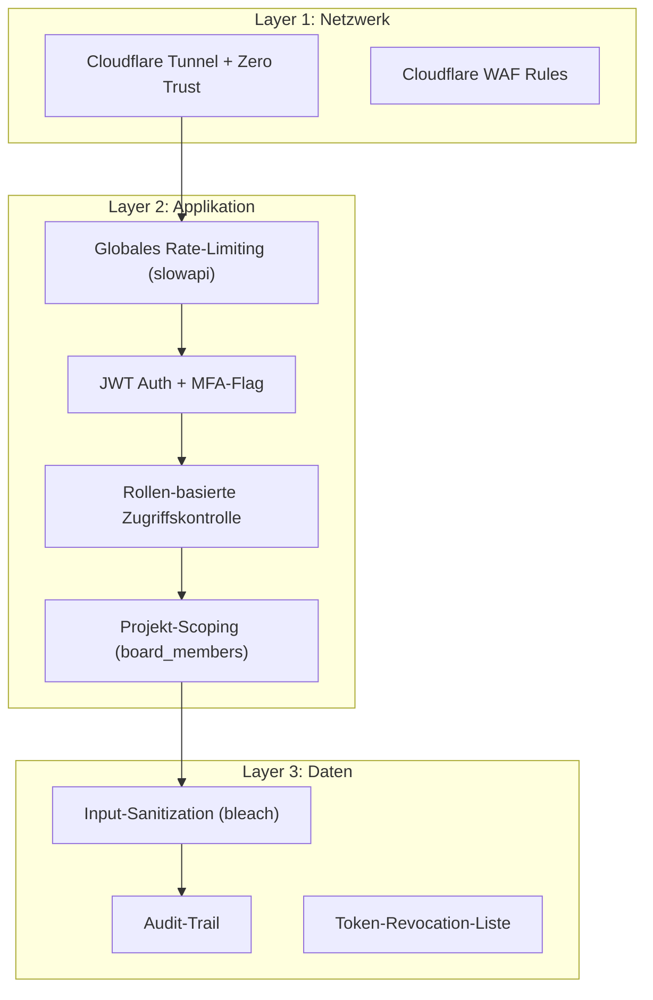

# Security Hardening und Kundenzugang fuer TaskPilot

## Risiko-Analyse: Ist-Zustand

### Was heute gut ist

- **Cloudflare Tunnel + Zero Trust** als aeussere Huerde (Einmalcode per E-Mail)
- **JWT-basierte Auth** mit Rate-Limiting auf Login (10 Versuche / 5 Min)
- **Owner-Guard** fuer User-Management-Endpoints
- **Alle API-Routen** (bis auf `/login` und `/health`) erfordern ein gueltiges Token
- **`board_members`-Tabelle** existiert bereits im Schema (projekt-basierte Gaeste)

### Kritische Luecken

| Risiko | Schwere | Beschreibung |
|--------|---------|--------------|
| Kein MFA | Hoch | Ein kompromittiertes Passwort = voller Zugriff auf E-Mails, CRM, Buchhaltung |
| Token in localStorage | Mittel | XSS-Angriff kann Token stehlen; kein HttpOnly-Cookie |
| Keine Rollen-Durchsetzung auf Routen | Hoch | `member`/`viewer` haben Zugriff auf ALLE API-Endpunkte (Emails, Bexio, Pipedrive...) |
| `/uploads/` ohne Auth | Mittel | Statische Dateien oeffentlich, wenn URL bekannt |
| `/docs` und `/openapi.json` exposed | Niedrig | Angreifer sieht gesamte API-Struktur |
| Kein globales Rate-Limiting | Mittel | Brute-Force auf beliebige Endpunkte moeglich |
| JWT-Expiry 7 Tage | Mittel | Gestohlene Tokens lange gueltig, kein Revocation-Mechanismus |
| CORS allow_methods/headers = * | Niedrig | Zu permissiv fuer Produktion |
| Keine Input-Sanitization | Niedrig-Mittel | Stored XSS moeglich bei Task-Titeln/Beschreibungen |

### Angriffsszenarien bei Kundenzugang

1. **Horizontale Eskalation**: Kunde mit `member`-Rolle ruft `/api/emails`, `/api/bexio`, `/api/pipedrive` auf -- sieht deine E-Mails, Buchhaltung, CRM-Daten
2. **Agent-Missbrauch**: Kunde erstellt Agent-Job, der auf MCP-Server zugreift (Graph, Bexio, Toggl)
3. **Token-Diebstahl via XSS**: Kunde fuegt Markdown/HTML in Task-Beschreibung ein, das bei dir XSS ausfuehrt
4. **Session-Hijacking**: Cloudflare OTP schuetzt den Tunnel-Zugang, aber INNERHALB der App gibt es keinen zweiten Faktor

---

## Empfehlung: Soll Kundenzugang erlaubt werden?

**Ja, aber NUR unter folgenden Bedingungen:**

1. **Strikte Rollen-Isolation** im Backend (nicht nur UI-seitig)
2. **Per-Projekt-Scoping** -- Kunden sehen NUR ihr freigegebenes Projekt
3. **Kein Zugriff** auf: E-Mails, CRM, Buchhaltung, Agent-Jobs, Triage, Settings, Chat, Pipeline
4. **MFA fuer Owner** (dich) als Pflicht
5. **Kuerzere Token-Laufzeit** fuer Kunden (z.B. 4h statt 7 Tage)

---

## Defense-in-Depth-Architektur

---

## Rollen-Modell (erweitert)

| Rolle | Zugriff | Anwendungsfall |
|-------|---------|----------------|
| `owner` | Alles | Anthony (du) |
| `member` | Ausgewaehlte Projekte, Tasks erstellen/bearbeiten, kein Agent, keine externen APIs | Interner Mitarbeiter (Zukunft) |
| `guest` | EIN Projekt (read/write Tasks), Profil-Settings, Theme | Kunde |
| `viewer` | EIN Projekt (read-only) | Kunde (nur Einsicht) |

Wichtig: Die Rolle `guest` existiert heute noch nicht im CHECK-Constraint. Der Constraint muesste erweitert werden.

---

## Konkrete Haertungs-Massnahmen

### Phase 1: Sofort (ohne Kundenzugang, haertet das System fuer dich)

1. **MFA fuer Owner** -- TOTP (Google Authenticator / Authy) als zweiter Faktor nach Login
2. **Token-Laufzeit verkuerzen** -- Prod: 24h statt 7 Tage; Refresh-Token-Pattern einfuehren
3. **`/docs` und `/openapi.json` in Prod deaktivieren** -- `docs_url=None, redoc_url=None, openapi_url=None` wenn `debug=False`
4. **`/uploads/` schuetzen** -- Auth-Middleware statt StaticFiles-Mount; oder signierte URLs
5. **Globales Rate-Limiting** -- `slowapi` mit sinnvollen Limits (z.B. 100 req/min global, 20/min fuer schreibende Ops)
6. **CORS einschraenken** -- `allow_methods=["GET","POST","PATCH","DELETE"]`, `allow_headers=["Authorization","Content-Type"]`
7. **HttpOnly-Cookie** als Alternative zu localStorage (optional, aber empfohlen)
8. **Security-Headers** -- `X-Content-Type-Options`, `X-Frame-Options`, `Strict-Transport-Security` via Middleware

### Phase 2: Rollen-Isolation (Vorbereitung fuer Kundenzugang)

1. **RBAC-Middleware** -- zentrale Dependency `require_role(min_role)` die Routen nach Rolle schuetzt
2. **Route-Kategorien** definieren:
   - **owner-only**: `/api/emails`, `/api/bexio`, `/api/pipedrive`, `/api/toggl`, `/api/signa`, `/api/intelligence`, `/api/triage`, `/api/auth/users`, `/api/settings` (Integrationen)
   - **member+**: `/api/tasks`, `/api/projects`, `/api/agent-jobs` (nur eigene), `/api/chat`
   - **guest+**: `/api/projects/:id` (nur freigegebene), `/api/tasks` (nur im eigenen Projekt), `/api/auth/me`, `/api/uploads` (nur projektbezogen)
3. **Projekt-Scoping** -- `board_members`-Tabelle aktivieren; jede Query auf Tasks/Columns fuer Gaeste durch `WHERE project_id IN (SELECT project_id FROM board_members WHERE user_id = :uid)` filtern
4. **Agent-Job-Blockade fuer Gaeste** -- `guest`-Rolle darf keine Agent-Jobs erstellen (Backend-Check)

### Phase 3: Kundenzugang implementieren

1. **Einladungs-Flow** -- Owner laedt Kunden per E-Mail ein → Auto-User mit `guest`-Rolle und Projekt-Zuweisung
2. **Frontend-Routing nach Rolle** -- Gaeste sehen NUR: Login, Projektboard, Profil-Settings (Theme/Name)
3. **Kuerzere Token-TTL fuer Gaeste** -- 4h, kein Refresh-Token
4. **Audit-Log** -- Jede Kunden-Aktion protokollieren (wer hat was wann getan)
5. **Input-Sanitization** -- Bleach/DOMPurify fuer Task-Beschreibungen (Stored-XSS-Schutz)

---

## Cloudflare-seitige Haertung (parallel)

| Massnahme | Beschreibung |
|-----------|-------------|
| **WAF Managed Rules** | OWASP Core Ruleset aktivieren (gratis im Free-Plan teilweise) |
| **Bot Management** | Verified-Bots-Only fuer API-Zugriff |
| **Access Policy Gruppen** | Separate Policies: InnoSmith-intern = alle Subdomains; Kunden = nur `tp.innosmith.ai` |
| **Geo-Blocking** | Optional: nur CH/DE/AT zulassen |
| **Session Duration** | Prod: 8h (statt 24h); Kunden: 4h |
| **Device Posture** | Optional fuer Zukunft: nur Managed Devices |

---

## Zusammenfassung der Empfehlung

- **Kundenzugang ist vertretbar**, aber NUR mit strikter Backend-RBAC und Projekt-Scoping (nicht nur UI-Hiding)
- **MFA fuer den Owner ist Pflicht** -- das System steuert E-Mails, CRM, Buchhaltung
- **Phase 1 (Haertung) sollte VOR Phase 3 (Kundenzugang) kommen** -- erst das Fundament sichern
- **Cloudflare bleibt die erste Verteidigungslinie** -- Kunden erhalten Zero-Trust-Zugang nur fuer `tp.innosmith.ai`, nie fuer Dev/Int
- **Langfristig**: Token-Revocation, Audit-Trail, und optional Device-Posture-Checks

---

## Betroffene Dateien

- [src/backend/app/auth/deps.py](src/backend/app/auth/deps.py) -- RBAC-Erweiterung, `require_role()`
- [src/backend/app/routers/auth.py](src/backend/app/routers/auth.py) -- MFA-Flow, Einladungs-Endpoint
- [src/backend/app/config.py](src/backend/app/config.py) -- Token-TTL, MFA-Settings
- [src/backend/app/main.py](src/backend/app/main.py) -- Security-Headers, Docs-Deaktivierung, Rate-Limiting
- [db/schema.sql](db/schema.sql) -- Role-CHECK erweitern, evtl. `mfa_secret`-Spalte
- [src/frontend/src/App.tsx](src/frontend/src/App.tsx) -- Rollen-basiertes Routing
- Alle 30+ Router-Dateien -- `Depends(require_role(...))` ergaenzen
